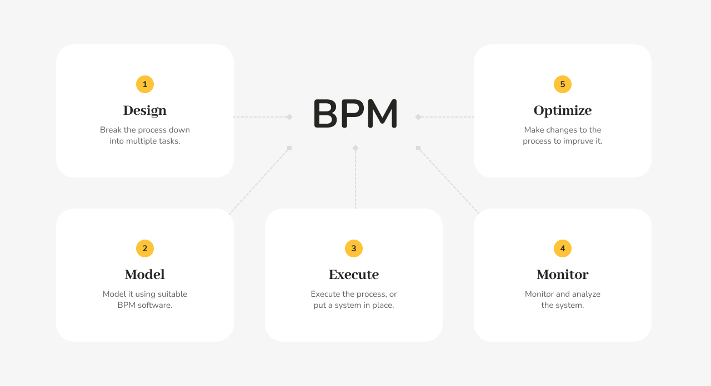
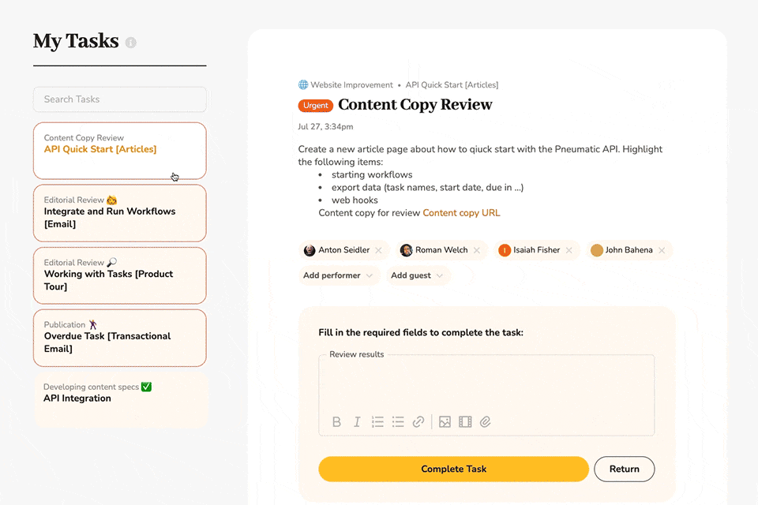

# Why You Need Pneumatic

## What is Pneumatic

Pneumatic is a workflow management system custom-designed for fast-growing startups and small businesses.

## Growing Pains of Startups

If you run a small business or startup, chances are you have a small, tightly-knit team of highly motivated individuals who each know what's going on in the company at any given moment and what they need to be doing.

It's a highly informal environment in which the company is pretty much running itself.

What happens when you start growing and not just in terms of the amount of business you get but in terms of the number of new people you need to hire to handle all this new business?

## The Inflexion Point

As you go past the inflection point of 25-30 staff, the informal processes that you've relied on so far have a nasty tendency to break down; suddenly, you have people just hanging around the office or in your Zoom meet-ups that look completely at a loss. You hired them, but somehow, nobody told them what's expected of them, and they only have a very vague idea about what they're supposed to be doing.

**Productivity per employee plummets as your business begins to experience diseconomies of scale due to increased organizational complexity.**

## Organizational complexity

Organizational complexity is an issue that every growing business is bound to encounter sooner or later. The trick is not to let it overwhelm and ultimately kill your company. Organizational complexity needs to be managed, and you manage it through workflow management.

What you want to do at this point is to start formalizing your informal business processes, and Pneumatic lets you do just that and more.

Not only can you describe your business processes formally with Pneumatic templates, but you can also then run workflows from those templates so that every member of your team will know what they're supposed to be doing at any given moment.

## Workflow management solution

Enter Pneumatic, a system that brings enterprise-grade workflow management capabilities to the startup masses operating on a shoestring budget. Pneumatic simplifies workflow optimization, making it easy to understand and delivering it as a free product.

Our mission is to allow newly minted chief operations officers to build their first formalized workflow within minutes of getting a Pneumatic account.

With Pneumatic you don't need uber-expensive business process management consultants, instead, you get a powerful visual lego-like interface to define and run workflows in.

We focus on companies that have just gone past the two-pizza team size and that now need a simple yet powerful tool to start easing into more formalized business process management.

In Pneumatic, you describe your business processes with workflow templates. You then run workflows from your workflow templates, and the members of your team that [tasks](../features/my-tasks.md) were assigned to in the workflows immediately get notified of what they're supposed to do.

As they complete their tasks, the workflows move forward, and new tasks get assigned to other or the same team members.

## Delage Operations Management to Pneumatic

The result is that the grind of operations management gets delegated to Pneumatic. All you have to do is [create the workflow templates](../getting-started/a-quickstart-guide-to-your-pneumatic-dashboard.md) and refactor them from time to time as your business evolves. Pneumatic will be doing all the workflow management for you while you and your team can concentrate on creating value for your customers.

To learn more about how Pneumatic works, you can [request a demo](https://calendly.com/pneumatic/pneumatic-intro), and sign up for our Premium plan today, we offer a 100% one-month money-back guarantee.
