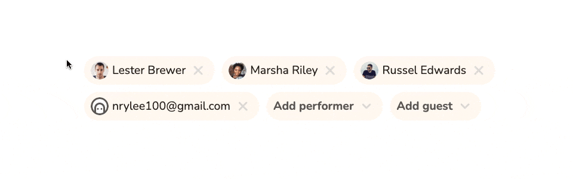

# Adding/Deleting Performers and Guests

When you get assigned a task in Pneumatic you can try and get help by adding performers and/or guests to it.

## Performers

Clicking on Add performer opens up a list of your teammates who already have accounts in Pneumatic.

Note that you can also use this dialog to invite someone to join your team in Pneumatic.

## Guests

Guests are people who don't have an account in Pneumatic but whom you can still invite to take part in the work on your task on an ad-hoc basis, using their email.

When you invite someone to a task as a guest, they get an email with a link to that specific task.

The link allows them to view the task and all the comments, as well as complete the task. Be aware that if a task does not require completion by all performers, a guest can complete it and push the underlying workflow forward to the next step. Naturally, in some situations that might be exactly what you want, you want to bear this in mind when inviting guests to participate in your tasks.

## Deleting performers

Any performer or guest can be removed from a task by clicking on the x next to their name or email.

It is, however, impossible to delete the last performer. In Pneumatic a task must always have at least one performer. You can still reassign the task to somebody else by adding them to the task as a performer and then deleting yourself from the list of performers.

​
