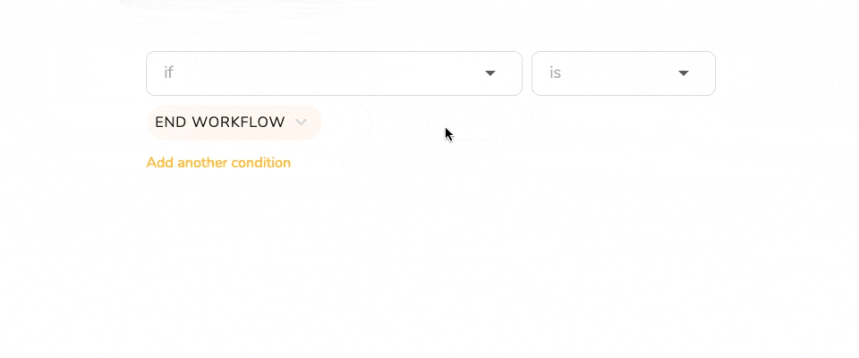

# Conditional Workflow Logic

## Conditional Task Execution

One of the advanced features included in our Premium plans is an option to add conditions to workflows. The feature adds a tremendous amount of flexibility to workflow design: essentially, workflows get built on the fly depending on the outputs of specific steps.

Using conditional workflow logic instead of having multiple templates to cover every possible eventuality, you can have one template that will *START* or *SKIP* specific tasks depending on whether a particular set of conditions is triggered.

## Including and Excluding Tasks based on Conditions

For example, in the lead nurturing workflow, the task to call the customer to confirm their phone number can be either included in the workflow or excluded from it depending on whether a phone number for the prospect is available.

In the screenshot above, the 'welcome-call task' of the *customer on-boarding workflow* has two conditions that must be met for a task to get activated: the new lead must have a phone number and an email listed on file. If neither a phone number nor an email address has been provided, the task gets skipped.

## Chaining Conditions with Logical Operators

Multiple conditions can be chained using the logical operators OR and AND:

If the chained conditional statement assembled in the graphical interface evaluates to true, the task can be **skipped** or **started**; alternatively, the **entire workflow can be ended**.

## Conditional Operators for Different Types

Different types of fields have different conditional operators, such as: doesn't exist, exists, contains, doesn't contain, etc., which are selected from a dropdown list.

* **Small Field**: equal, not equal, contains, doesn't contains, exists, doesn't exist
* **Text Field**: equal, not equal, contains, doesn't contains, exists, doesn't exist
* **URL Field**: equal, not equal, contains, doesn't contains, exists, doesn't exist
* **Attachment Field**: exists, doesn't exist
* **Dropdown Field**: equal, not equal, exists, doesn't exist
* **Checkbox Field**: equal, not equal, contains, doesn't contains, exists, doesn't exist
* **Radio Field**: equal, not equal, exists, doesn't exist
* **User Field**: equal, not equal, exists, doesn't exist
* **Date Field**: equal, not equal, more than, less than, exists, doesn't exist

## Ultimate Flexibility

The power of conditional workflow logic allows you to create one template to rule them all: specific tasks will then be included in the workflow or skipped dynamically depending on whether or not the conditions you defined in the template are met. This ultimately translates into less work and more automation.

Conditional workflow logic is a feature included in our Premium Plan.
