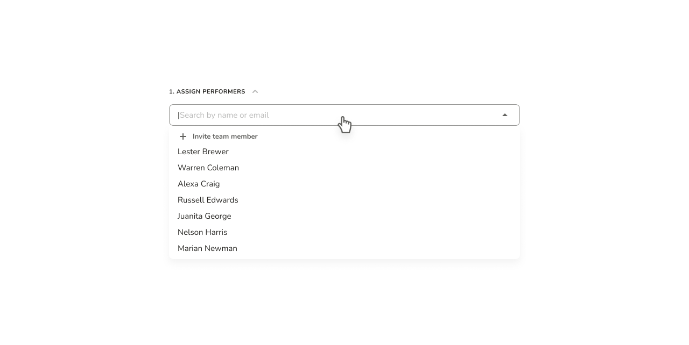
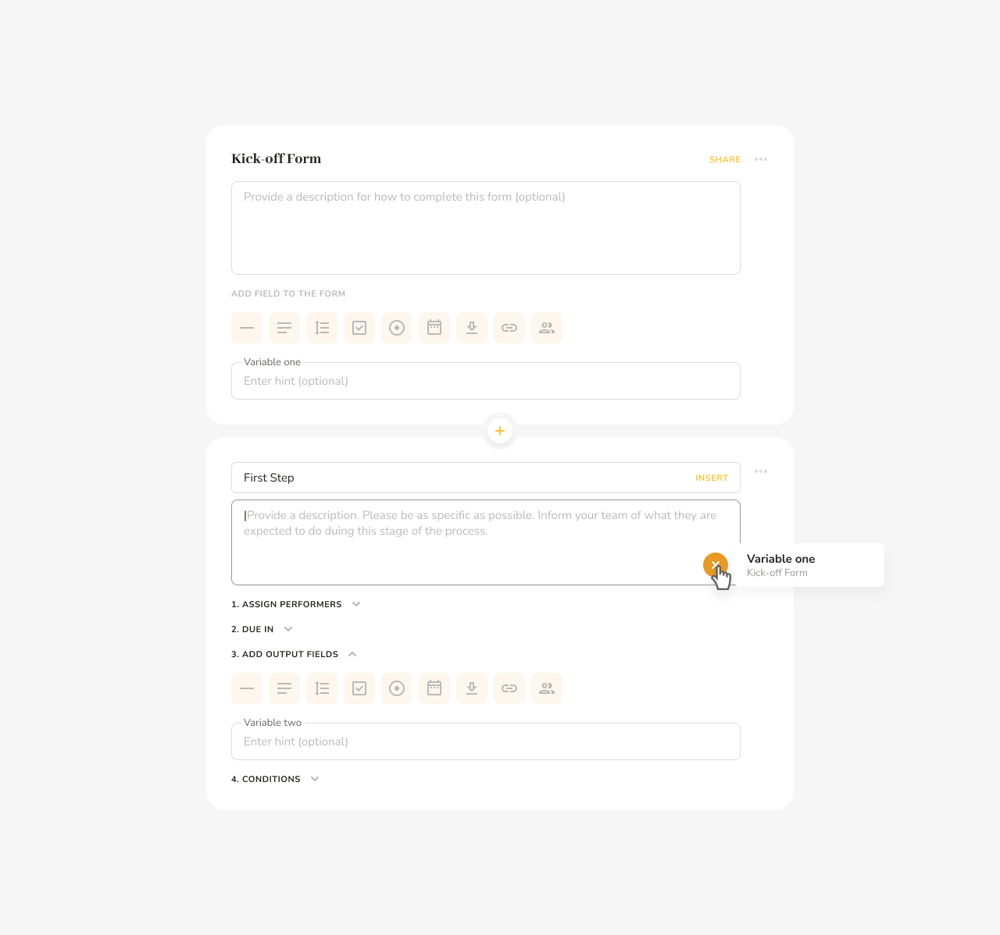
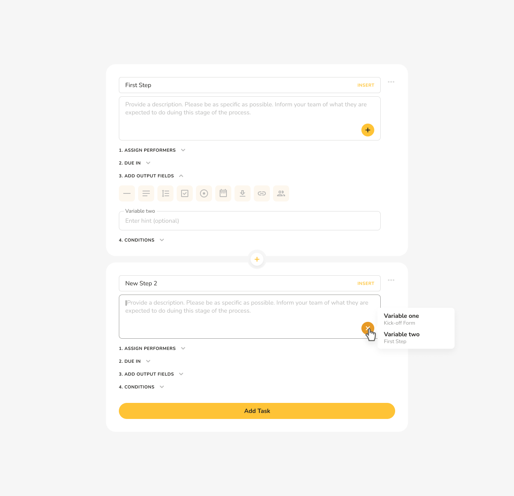
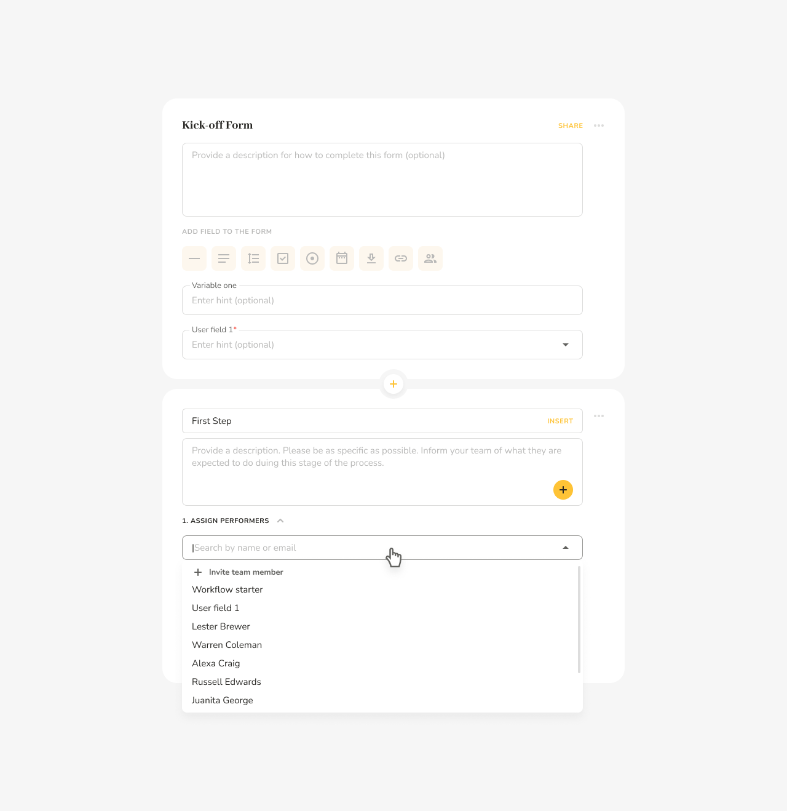
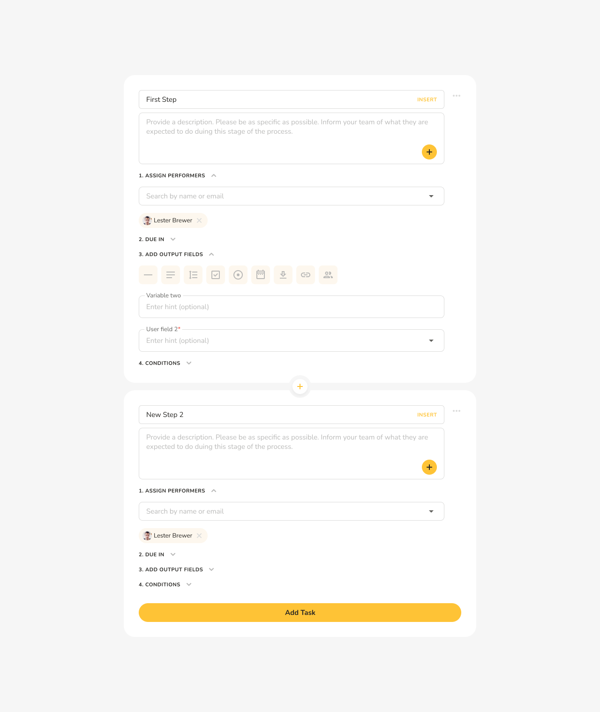

# Data Fields in Workflows

## What it’s all about

A workflow is a sequence of tasks. Each task has a description telling whoever it’s assigned to what they need to do to complete it.

Now, what if I told you that every time a new workflow is launched you can get some inputs from the user and then use those inputs in the task descriptions dynamically?

What if I also told you that you can define outputs for each task and then use those outputs in the descriptions for any task that follows it in the workflow?

And last, but not least, what if I then went and told you that you can set up your workflows so that they will ask the user who they want specific tasks to be assigned to each time they run a new workflow? All this functionality is provided by kick-off form fields and task output fields.

## What they are

Kick-off form fields and task output fields are data containers you can add to any workflow template. Pneumatic supports several types of such data containers:

* Small text field
* Large text field
* A dropdown list
* A checkbox
* A radio button
* A date
* An attachment
* A link
* A user type

## How to add them

You can add kick-off form fields to get the initial inputs from the user whenever a new workflow is run from the template:

Or you can add output fields to any task/step in your workflow:

## How to use them:

Once added, kick-off form fields and output fields can be inserted in the names of your tasks (just once and only small text field fields) or in the description field of any task :

Look for the plus icon:

Clicking on it will open up a list of the fields that you can use in the current context:

User-type fields can be used to dynamically assign tasks. User type fields show up in the list of performers for your task:

## Where you can use them:

Kick-off form fields can be used throughout the workflow template and task output fields can be used anywhere past that task, i.e. in all the subsequent steps of the template. For example, if we create a new template and add a kick-off form field to it, then we will be able to use i in the first stpe of our template.

We cannot, however, use the output field we defined in step one in the same step. It is only available for use in subsequent steps.

Note how in step 2 we have access to both the kick-off form field and the output from the previous step. The same rules apply to user fields - if I add a user field to my kick-off form, I’ll be able to assign the first step in my workflow template to that user field

I can then add another user field to my first step, but it’s only going to be available in step 2.

