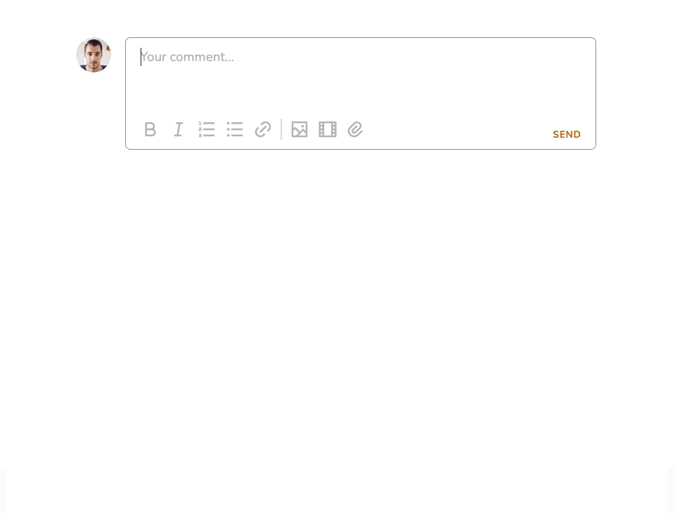

# Embedding Videos

## Embedding Videos in Task Descriptions and Comments

Pneumatic has an ever-expanding list of supported video-hosting services that it can automatically detect when you insert a link to a video hosted on one of them into a task description or comment.

Video-based educational workflow sequences can help a great deal with **remote employee onboarding** or making sure that your existing team can follow a crucial workflow with precision by providing them with a clear on-screen instructions.

You past your video link into a task description and comment and as soon as you save it, Pneumatic checks if it's a support video hosting service and if it is it converts your link into a playable embedded video:

The video can now be played back by clicking on the play button.

Pneumatic currently supports seamless embedding of videos hosted on Youtube, Wistia and Loom, other video hosting services are soon to be added to this list.
