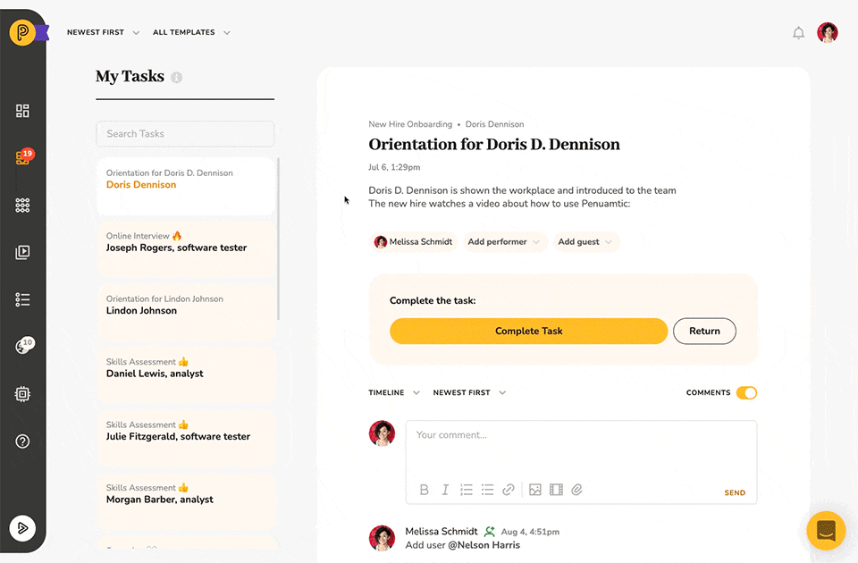

# Free External Users

## Engaging with the Outside World

Pneumatic was never intended as a walled garden and so it goes out of its way to make it as easy as possible for you to engage with external users. There are currently **two principal ways** you can engage with people who don’t have Pneumatic accounts and whose participation in your processes you don’t have to pay for.

## Guest performers

It's a completely **free** feature. You can engage with external users by inviting them as guest performers to your tasks.

If you get stuck with a task, you can add a performer from your team:

Or you can add a guest performer via email:

In the latter case, the guest will be sent an email notification with a link giving them access to this specific task. They will be able to view the task and all the associated comments, fill out the output fields and complete the task.

## Sharing Kick-Off Forms

Another way you can share workflow kickoff forms as long as they don’t have user fields.

When you share a kick-off form, Pneumatic rates an unique link that you can send via email or share on your website to enable people who don’t have accounts in Pneumatic to start new workflows for your team.

Workflows launched via external links are treated the same as workflows launched from within the system.

## Conclusion

Not every person you work with and not even every member of your team necessarily need a Pneumatic account: you can have them start processes in Pneumatic via sharable kick-off forms and contribute to specific tasks as guest performers without adding them as users to your Pneumatic account.
