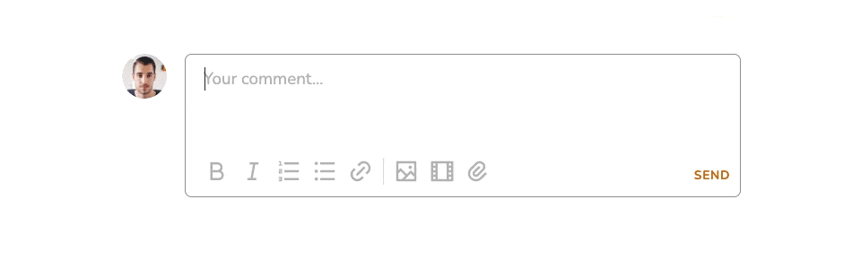
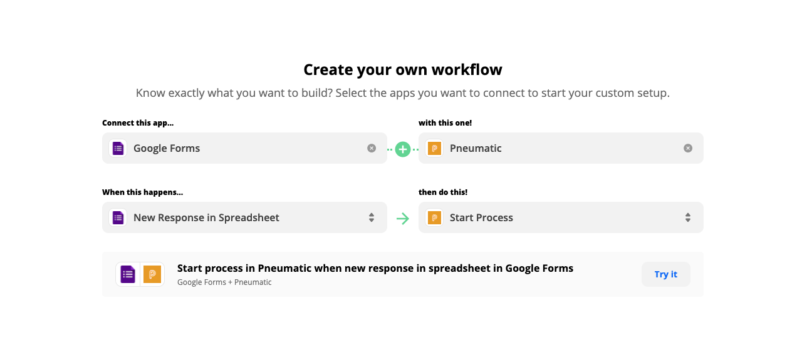
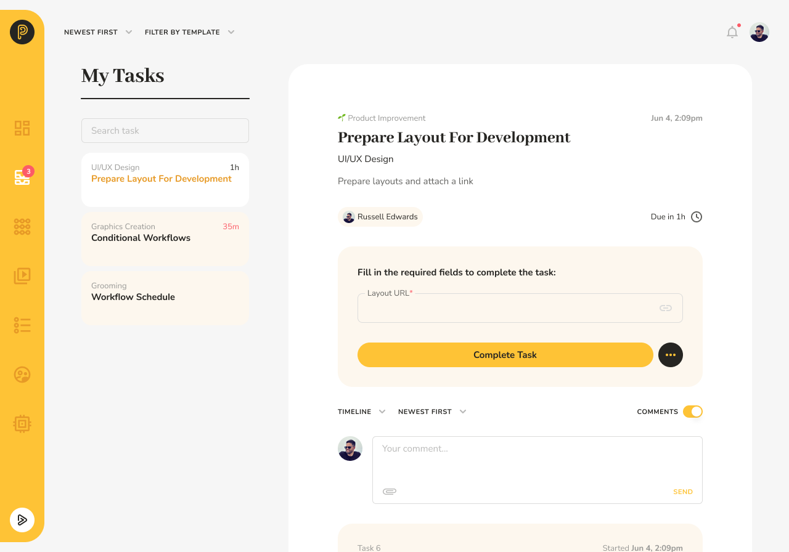
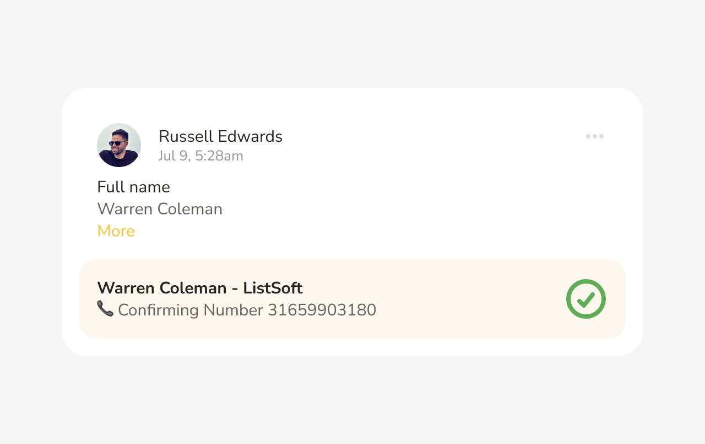

# Mentions

## Mentions in Comments

Pneumatic comments now support *mentions* (also known as tags on some social media platforms)

Mentions are highlighted in the text of the comment like this:

## And if someone has tagged you, you’ll be notified about it in two ways

**First**, when you log into your pneumatic account there will be a red dot on the notifications bell in the top-right hand corner, clicking on it opens a list of alerts, including mention alerts.

Naturally, clicking on a mention in the notifications list will take you directly to the comment you were mentioned/tagged in.

**Second**, you will be notified by email whenever people mention you and the email will contain a direct link to the comment you’re mentioned in.

You can mention/tag people not assigned to the task you’re commenting on. It’s a simple but very powerful feature that streamlines collaboration and aids communication within teams.

Enjoy!
