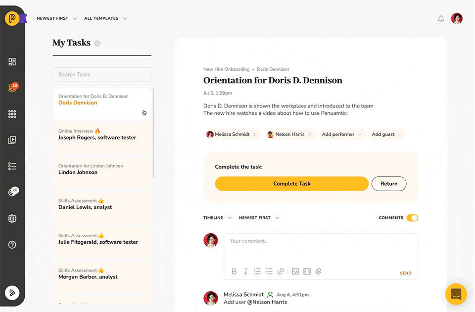
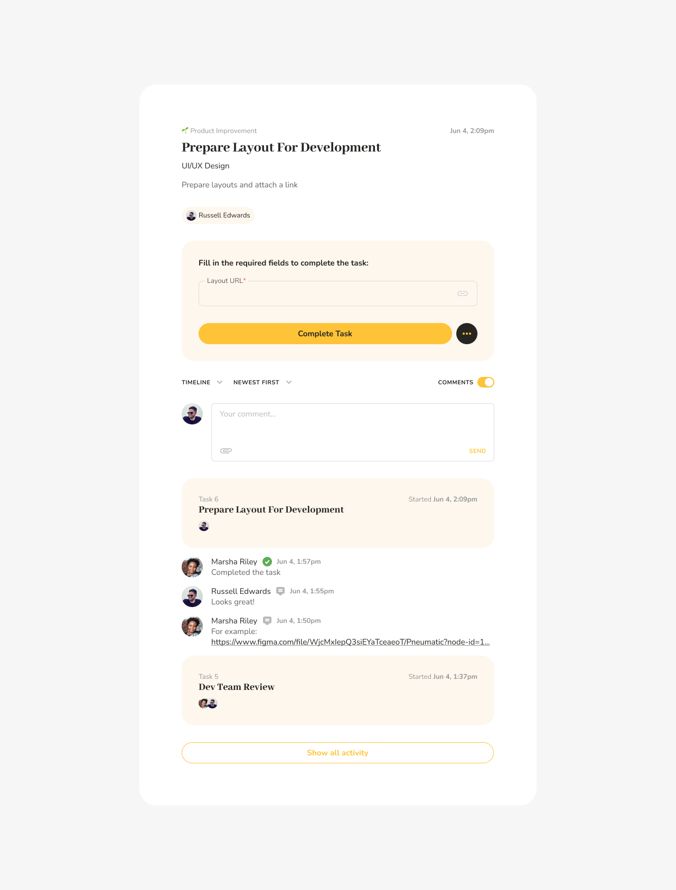

# My Tasks

## The My Tasks Interface Highlights:

* There are two main sections: a list of tasks on the left and detailed information about the selected task on the right.
* The entire workflow history is displayed in the workflow activity section below the task
* Tasks can be ordered in chronological or reverse chronological order, **overdue tasks** can be brought to the top
* Tasks can be filtered by the workflow template and workflow step

## One Task on the Right, List of Tasks on the Left

When you click on My Tasks you will now see a list of tasks on the left with the first task already selected and all selected task's details shown on the right:

## Dynamically Updated Task Information

When you select a task from the list of tasks, all its details are immediately displayed on the right, including the description, assignees, output fields, all the comments, and file attachments below.

## The Workflow Log

In addition, under the task description, you can now see the entire workflow log, i.e. all the tasks that had been completed up to the point when the current task was assigned to you.

At the very bottom, you can also view the original kick-off form entry data. This way, instead of simply getting a task description, you have access to the entire context of the task.

## Controlling How the Tasks are Displayed

The controls in the upper left-hand corner allow you to arrange tasks in chronological (newest first), reverse chronological order (oldest first) or bring up overdue tasks to the top of the list:

## Filtering Tasks

You can also filter tasks by workflow template name and workflow step.

To filter tasks by workflow template, you select the template you are interested in from the *Filter by Template* drop-down list:

Once a template has been selected only tasks that belong to workflows started from the selected template will be displayed in the list of tasks.

To further filter tasks by template step, you select the step you’re interested in from the *Filter by Template Step* drop-down list

Now the list of tasks will only contain tasks that belong to active workflows started from the selected template and correspond to the selected template step.

\_\_\_\_\_\_\_\_\_\_\_\_\_\_\_\_\_\_\_\_\_\_\_\_\_\_\_\_\_\_\_\_\_\_\_\_\_\_\_\_\_\_\_\_\_\_\_\_\_\_\_\_\_\_\_\_\_\_\_\_\_\_\_\_

## Summary

The My Tasks interface layout enables you to get the information you want in as few clicks as possible:

* As soon as you go to My Tasks you immediately see all the details about the latest task that's been assigned to you.
* To switch tasks, find it in the list of tasks on the left, click on it and the information displayed in the main section of the page gets updated immediately.
* See everything that happened in the workflow before the task got assigned to you.
* Improve your personal operational efficiency by batching similar tasks together with filters by the workflow template or template steps.

Being able to access more relevant information with less effort leads to great improvements in productivity.

Questions or feedback? We love to hear from you, reply here or schedule a time to discuss.
