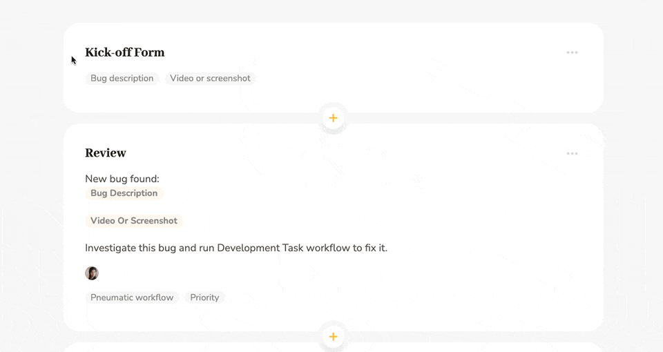
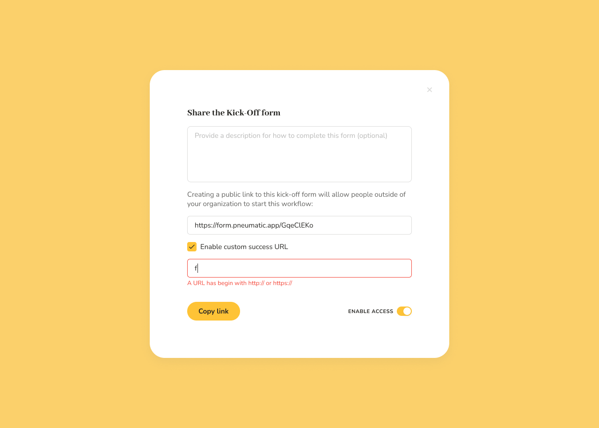
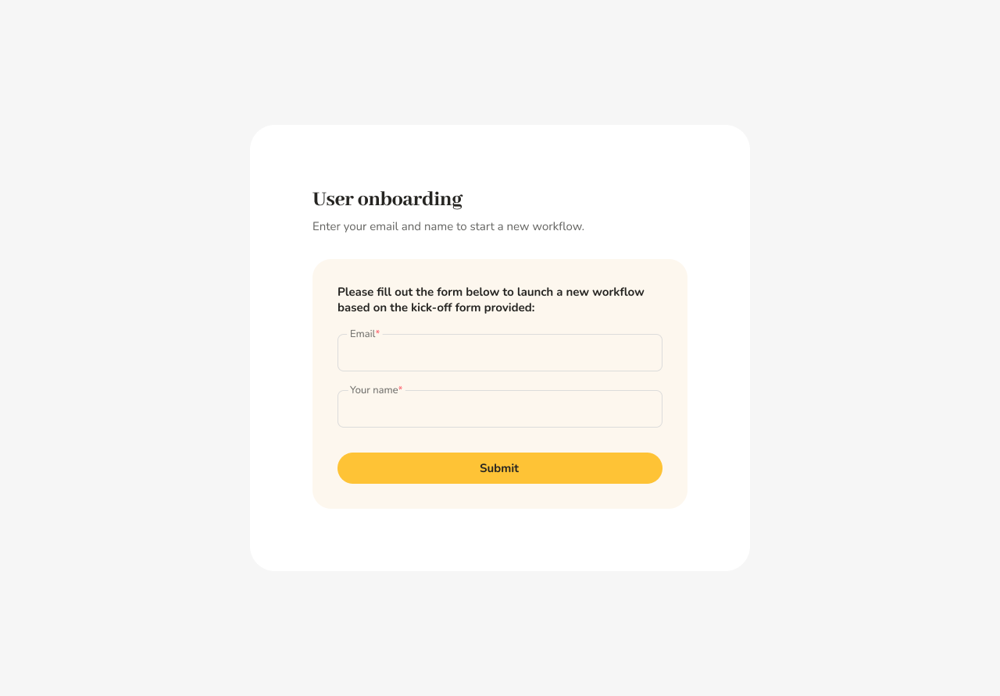
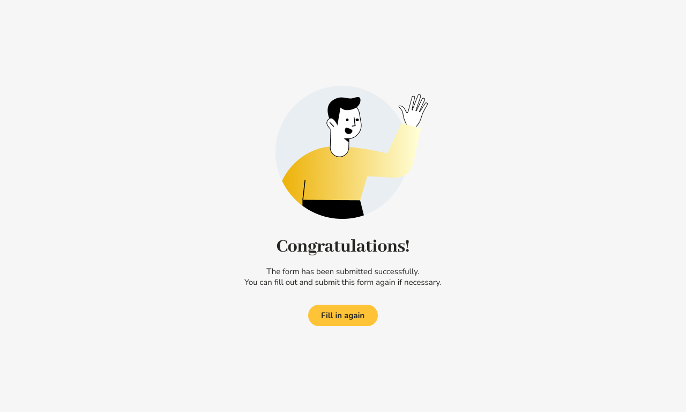

# Shareable Kick-Off Forms

## What shareable kick-off forms are for

In Pneumatic, every workflow template has a kick-off form, which is the first thing you see when you run a new workflow.

The default kick-off form simply asks the user to enter a unique name for the workflow.

As you design and customize a new template you can define a custom kick-off form to ask the user to supply additional information when they launch a new workflow.

Shareable kick-off forms allow you to have Pneumatic processes started by external users, such as customers, vendors, job applicants or members of your team who don’t have a Pneumatic account.

Possible use cases include but are not limited to:

* Contact forms
* Feedback forms
* Internal request forms
* Comments/suggestions forms
* Subscription forms
* Job application forms
* Client onboarding/registration
* And many others

Ultimately, wherever you have a business process that gets triggered by some external event, user or vendor interaction, the kick-off form for that workflow template can be shared so that new workflows can be started by users not registered in Pneumatic.

Shared kick-off forms can also be used by your own staff to run workflows without having to log into Pneumatic. For example, you can share them on your HR portal to let your team members submit vacation requests, expense accounts, sick leave notices, and the like.

## How to share kick-off forms in Pneumatic

All kick-off forms have a Share link on them:

To share a kick-off form you click on Copy Link. Pneumatic will warn you that you're about to share the template's kick-off form and then generate a unique link for you:

Pneumatic will automatically generate a shareable link, all you need to do now is copy the link by clicking on Copy Link and enable access to the kick-off form.

## Custom success URL

Another option that you have in this dialog is to enable a custom success URL.   
When you click on Enable Custom Success URL, a new field appears on the form where you can enter any URL you want:

The URL you type in this field has to start with http:// or https://, which the system will warn you about.  
​

The custom success URL is the URL that the user will be taken to once they have filled out the kick-off form and clicked Submit and a new workflow has been successfully launched in Pneumatic.

The goal of the custom success URL is to allow you to fine-tune your interaction with the user. Once they fill out and submit a shared kick-off form, they can be taken to your home page or to another shared kick-off form or your blog or a partner website or wherever.

## Filling out and submitting a shared kick-off form

Clicking on the link to a shared kickoff form opens the kick-off form for a new workflow:

Once the user fills out all the required fields and clicks Submit, they are told the form has been submitted successfully and Pneumatic starts a new workflow based on the information they provided.

If a custom success URL has been specified, the user will be taken to that URL after successfully submitting a shared kick-off form.

Internally, Pneumatic makes no distinction between workflows started from within the system and those launched using links to kickoff forms.

Kick-off forms can only be shared if they don’t have variable user fields in them.
