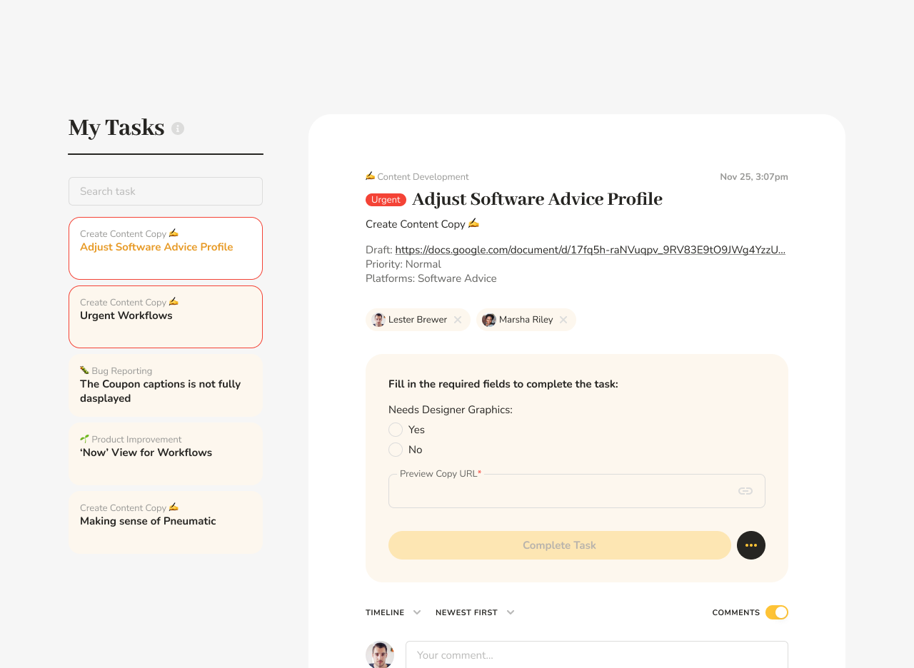

# Urgent Workflows for Top Priority Processes

## What urgent workflows are

There are three ways to make any Pneumatic workflow **Urgent**. You can label a workflow as urgent when you [run it](../getting-started/how-to-run-workflows.md):

You can go into your [Workflows](../videos/video-quick-product-overview.md) and mark any workflow as **Urgent** via the three-dots menu:

The **Urgent** toggle is also available in the workflow activity log view:

## How urgent workflows work

Once a workflow’s been marked as urgent, it will be highlighted with a red frame in the [Workflows view](../videos/video-quick-product-overview.md?utm_campaign=Urgent+Workflows&utm_content=Urgent+workflows+%F0%9F%94%A5&utm_medium=email_action&utm_source=customer.io), and brought to the top of the list:

In addition, any current tasks that are part of urgent workflows will be brought to the top of the [My Tasks](my-tasks.md) lists of all performers. For example, if I mark two of my workflows as urgent:

The tasks I have in those workflows will be brought to the top of [My Tasks](my-tasks.md) list:

## What urgent workflows are for

This feature enables you to quickly give top priority to workflows that require your team's urgent attention. We’re talking all-hands-on-deck situations when a specific job needs to be finished ASAP.

Once the crisis passes, you can toggle the urgent flag off so the workflow will go back to normal.
