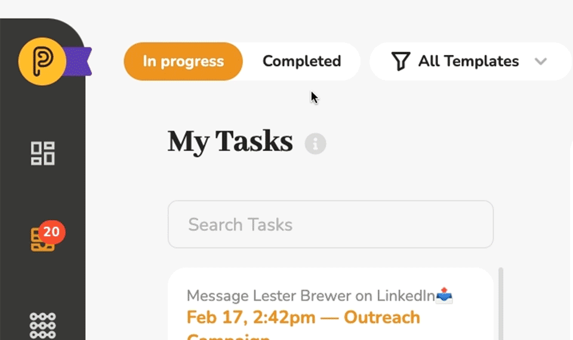

# View Completed Tasks

Did you know that in the My Tasks view not only can you filter your tasks by template and change the order in which they are displayed (newest, oldest or overdue at the top), you can also choose to view either tasks that are still in progress or tasks that have already been completed.

When you go into **[My Tasks](https://my.pneumatic.app/tasks/)**, you see your in-progress tasks by default.

Click on **Сompleted**, to see your completed tasks.

You can apply the same template filters and ordering to the list of completed tasks. It’s an indispensable tool that allows you to see what you’ve been up to and get a sense of the progress you’ve made with your tasks.
