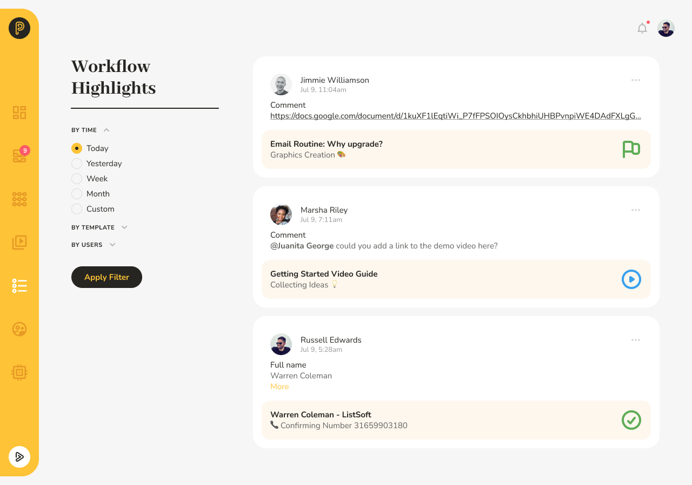

# Workflow Highlights

## Slice and Dice the Latest News

Workflow Highlights is a feature that allows you to filter workflows and tasks by template, user, and period of time/date.

Pneumatic Highlights is a powerful report-like dashboard that lets you slice and dice all the activity data of your team.

With Highlights you can explore in detail what your team or any one of its members have been up to in a specific process, during a particular time period.

## See What Your Team's Been Up to

**For example**, if you have a remote administrative assistant that you assign tasks to in Pneumatic workflows, you can go into Pneumatic HIghlights and see their latest activities over the past week in the active customer outreach workflows.

Pneumatic Highlights lets you keep closer tabs on your team's activities at all times.

For more on how to use Highlights [read here](../getting-started/how-to-use-workflow-highlights.md).
