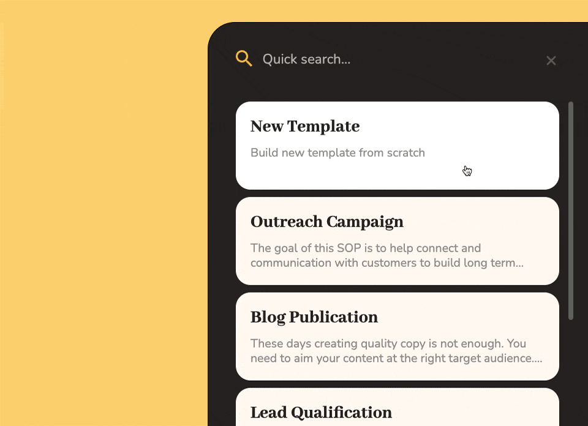

# A Quickstart Guide to Your Pneumatic Dashboard

This is a quick introduction to get you up and running with Pneumatic immediately.

## Start by Creating a New Workflow Template

A workflow template is essentially a workflow class or type that allows you to create similar workflows in less time.

There are two ways you can create a *Template* in Pneumatic:

* You can create your template by choosing one of the templates in our library and modifying it
* Or you can create a new template from scratch

## One Task after Another

A Template represents a standard operating procedure, a sequence of tasks for your team or specific members of your team to complete.

In each task, you can include a link to your favorite SaaS platform: Trello, Asana, Monday, etc.

Different tasks can be assigned to different teams or individuals. A task can be completed by one, several, or all the people assigned to it.

You may allow a task to be completed at any stage of the process:

## Optional Delays between Tasks

Each new task in the sequence starts after the previous one is completed or after an adjustable Delay.

## Start Multiple Workflows Based on Your New Template

There are 3 ways you can start new workflows based on your new Workflow Template.

1. You can go to Templates and click Play on your new Template
2. You can click on Play in the lower right-hand corner of any Pneumatic page
3. You can launch a new workflow via our API or Zapier integration

## Check the status of your running workflows

Go to the Workflows page to see all your workflows:

* Currently running
* Snoozed by triggered delays
* Completed
