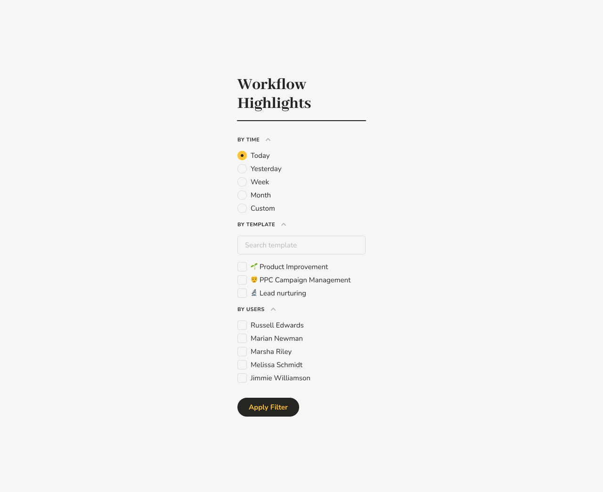

# How to Configure Which Emails and Notifications You Get From Pneumatic

## Edit Profile

To configure which emails and notifications Pneumatic sends you, go into Profile:

## Communications Management

On your Profile page in the Communications Management section, you can select or deselect which types of messages and notifications you want to receive from Pneumatic.

Just check/uncheck the relevant boxes and click on Save Changes.

With Pneumatic, you, the user, are always in control.
