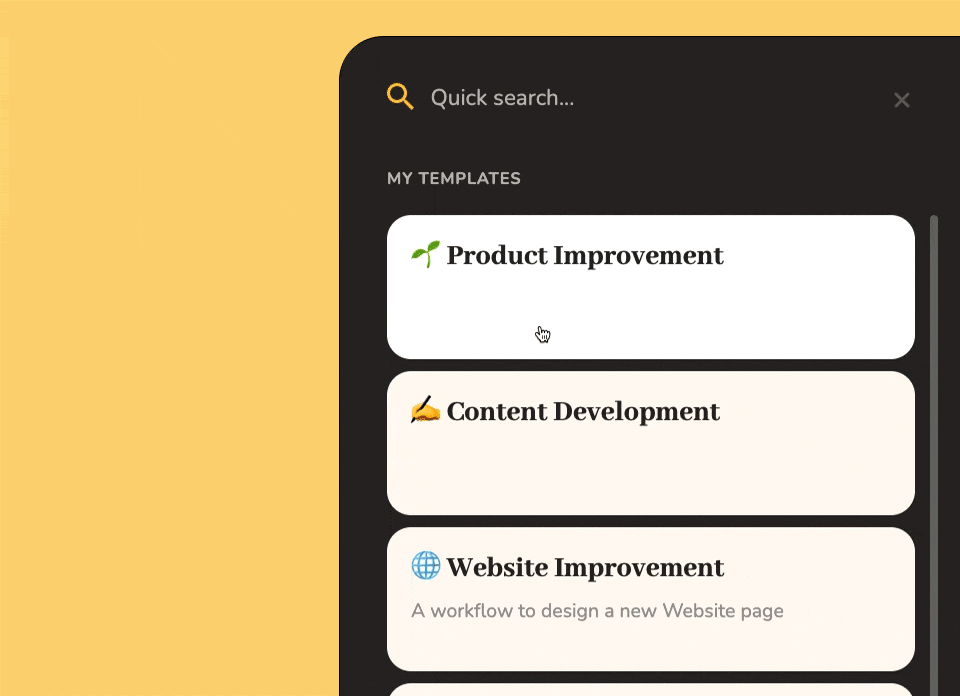
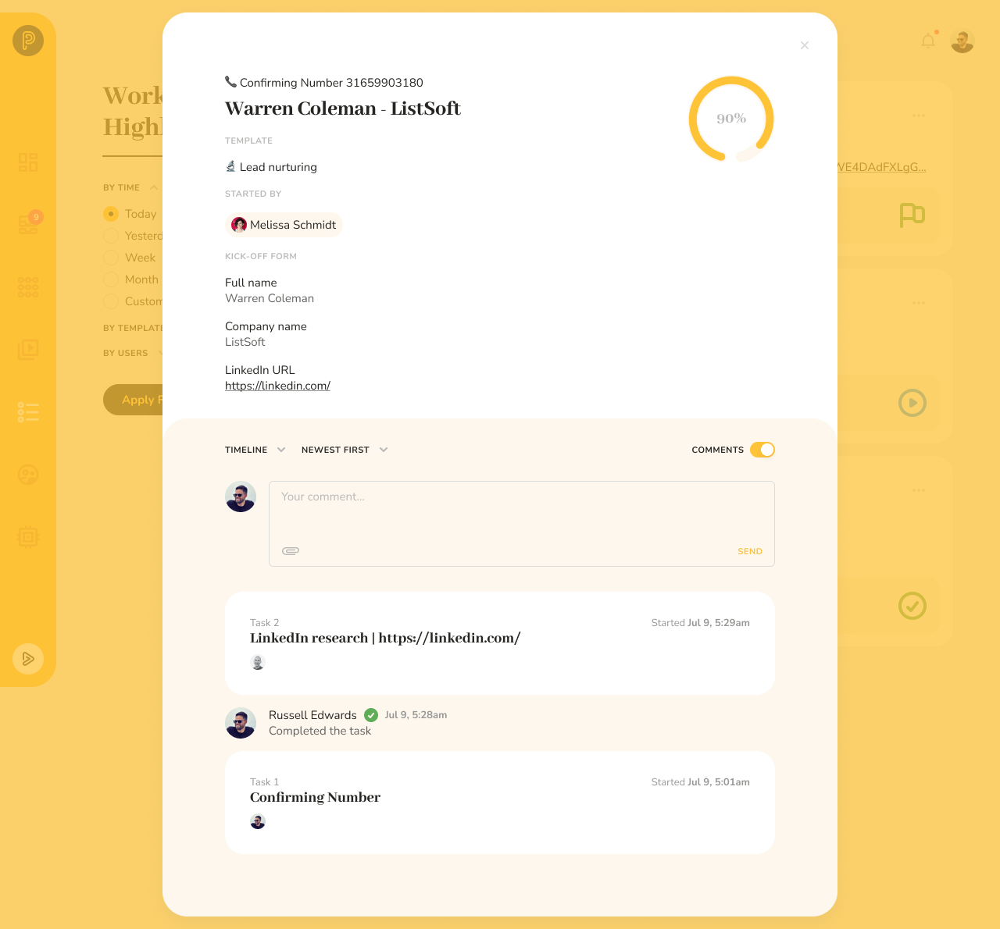
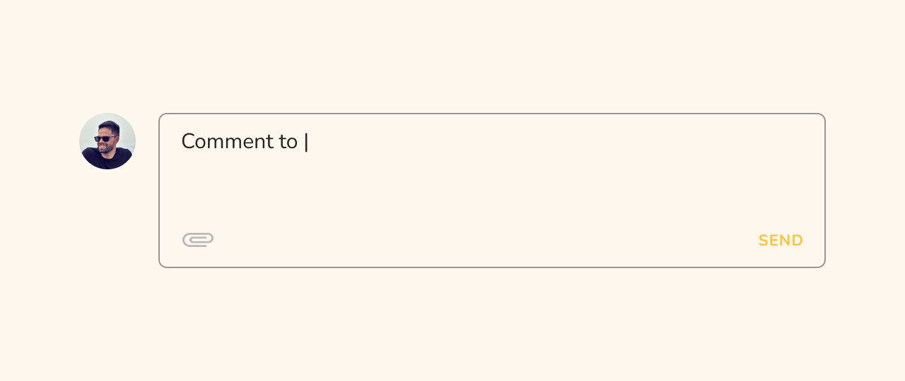
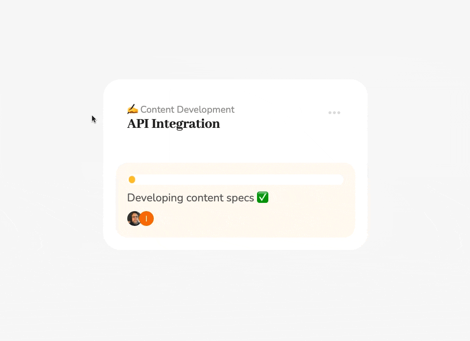
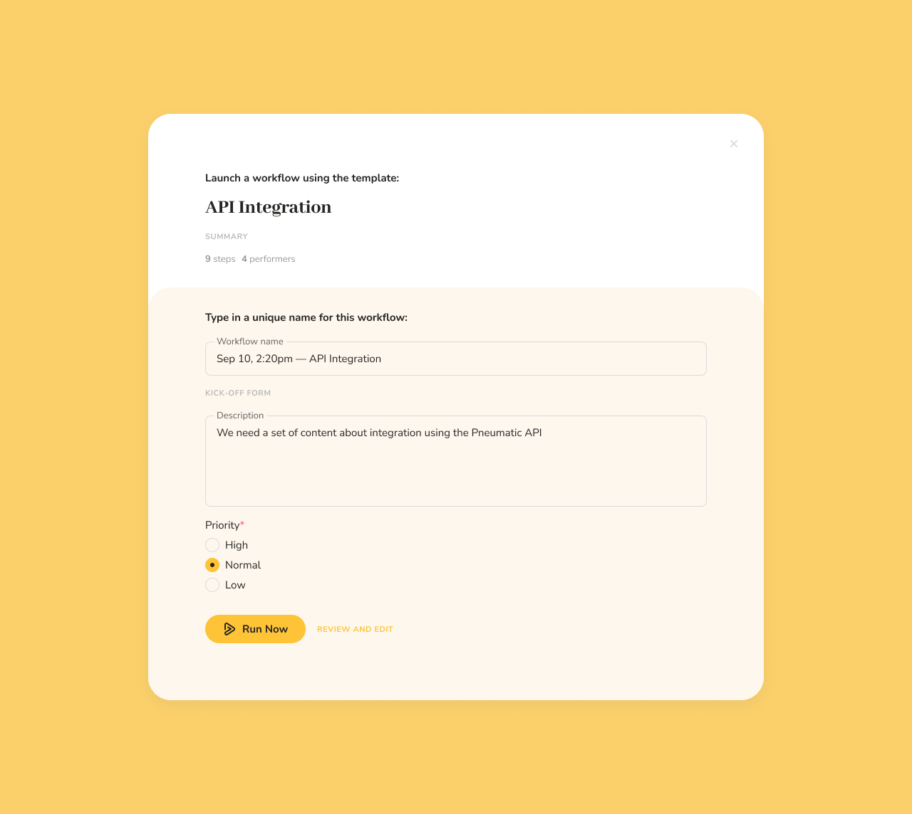

# How to Run Workflows

## Run Workflow Button

Pneumatic is a workflow management system so workflows are its bread and butter.

The easiest way to run a new workflow from an existing template is to click on the Run Workflow Button:

You can always find it in the bottom left-hand corner of your interface regardless of which section of Pneumatic you might be in at the moment.

## Choosing a Template to Launch a Workflow from

When you click on Run Workflow, the system displays a list of templates you can run new workflows from:

The Quick Search box allows you to enter the name of the template you want to quickly find it.

## Filling out the Kick-off Form

Once you see the template you want to run a new workflow from, just click on it to open its kick-off form.

Fill out the fields in the kick-off form (some can be optional, required fields are marked with red asterisks) and click on Run Now.

## Running a New Workflow

As soon as you do, Pneumatic will launch a new workflow and start assigning tasks to you and/or your team members.

## Running a Workflow from a Template Card

Alternatively, you can go into Templates where each active template's card has a Run Workflow button:

The effect is exactly the same: a new workflow kick-off form will open.

## Running a New Workflow from an Open Template

A new workflow can be run from the Template Editing interface. There is a Run Workflow button directly under the template name and description. It goes active as soon as you enable the template.

## Run Workflow Card in Workflows

Another place where you can start workflows is in the Workflows View:

Here, when no filters are applied, there is a big Run Workflow card. Click on it to open a list of templates you can launch workflows from.

## Cloning an Existing Workflow

And last but not least, if you click on the three dots in the upper right-hand corner of a workflow card in Workflows, one of the items on the dropdown menu that opens is Clone.

If you choose to "clone" an existing workflow, Pneumatic will open up a new workflow kick-off form in which all the fields are already filled in with the values from the workflow you're cloning:

This is an indispensable feature if you need to regularly run the same type of workflow with the same set of parameters.

In short, wherever you might find yourself in Pneumatic you can always run a new workflow.
