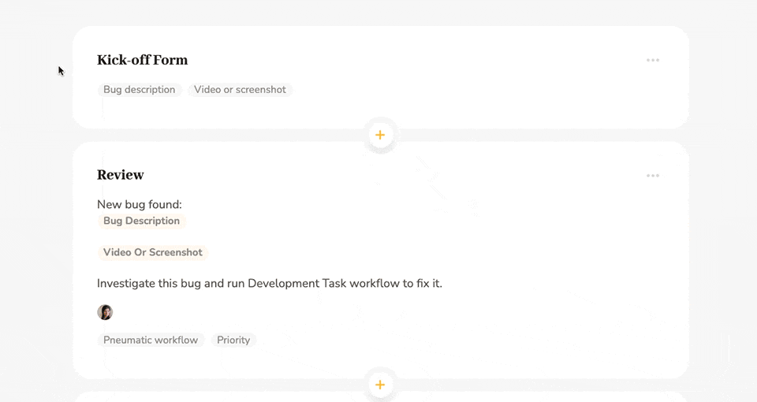

# Custom Success URL

Pneumatic's shareable kick-off forms allow you to make use of custom success URLs.

When you share a kick-off form, you can enable a custom success URL and then enter whatever URL you like as long as it starts with http:// or https://.

Pneumatic will remind you about this as you start filling out the custom success URL field.

The custom success URL is the URL that the user will be taken to after filling out and submitting the shared kick-off form.

Custom success URLs allow you to fine-tune your interactions with the user via shareable kick-off forms.

Instead of simply telling them that they've successfully filled out and submitted the kick-off form, you can continue to engage with them by taking them to a page of your choosing. This can be your home page or blog or another shared kick-off form if you want the user to start several workflows in one go.

---

**For more see** [How to share workflow template kick-off forms](../features/shareable-kick-off-forms.md)
