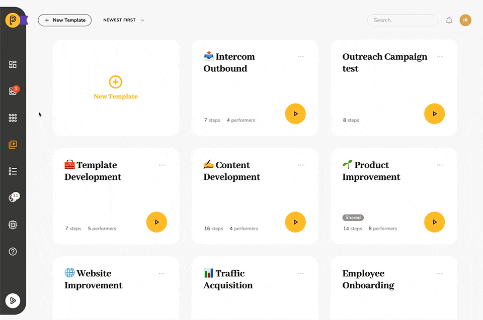
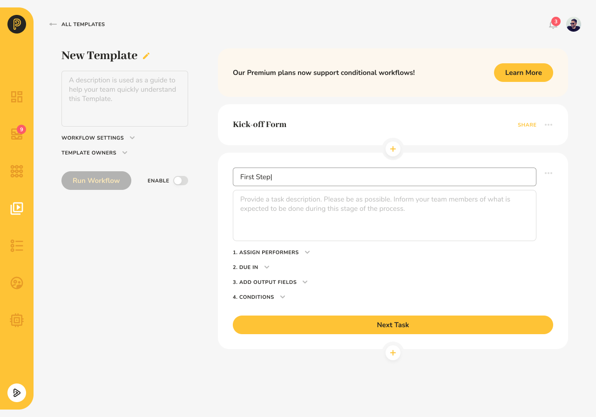
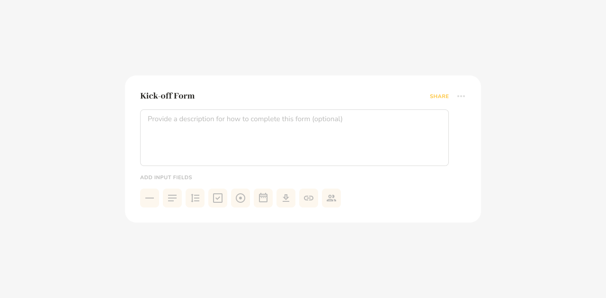
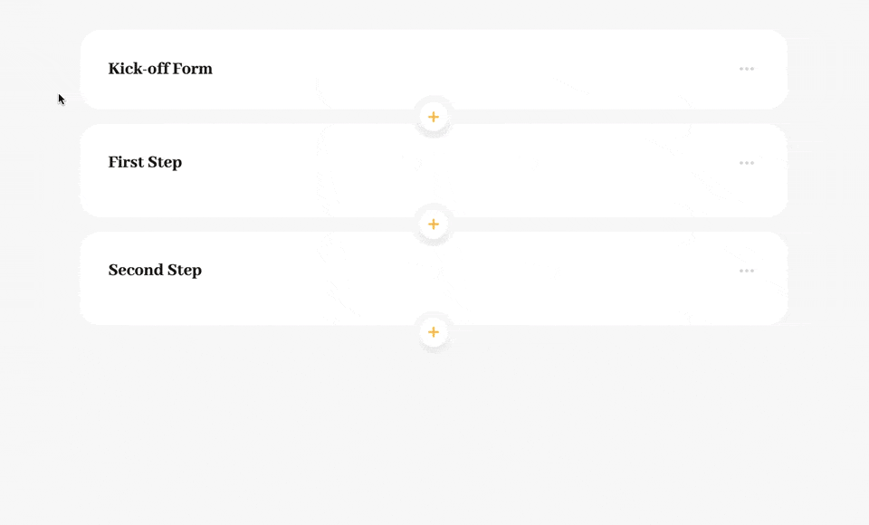
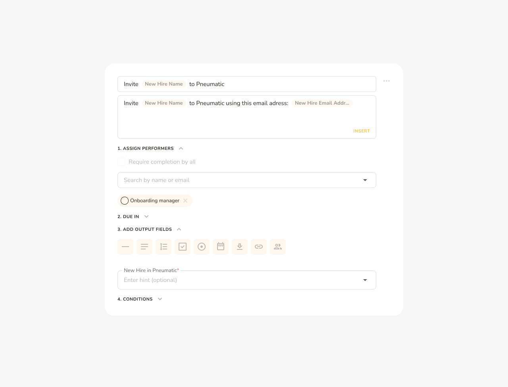
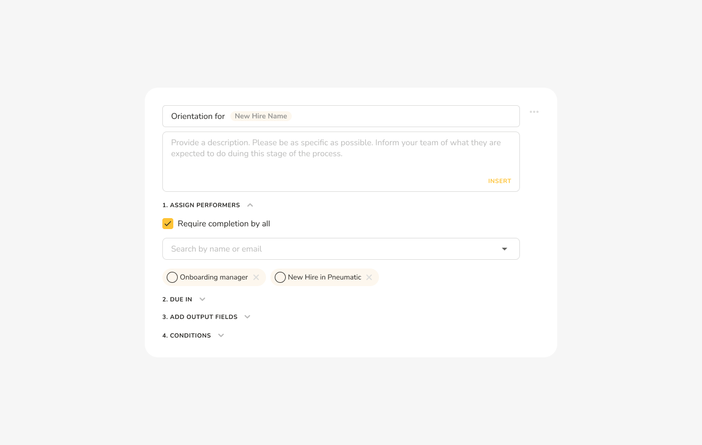
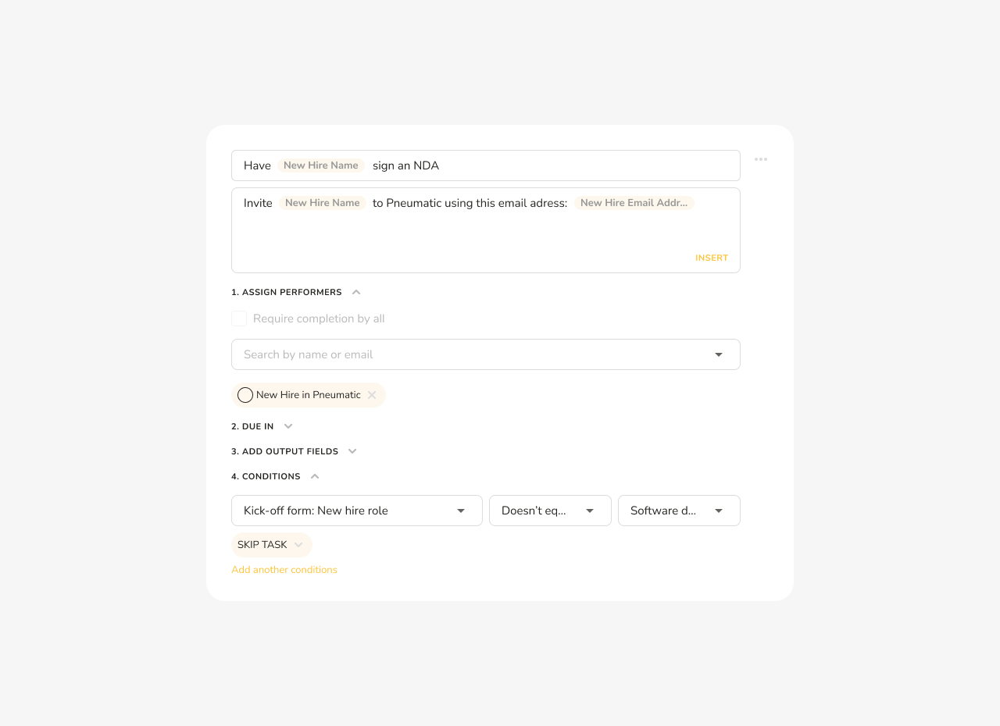
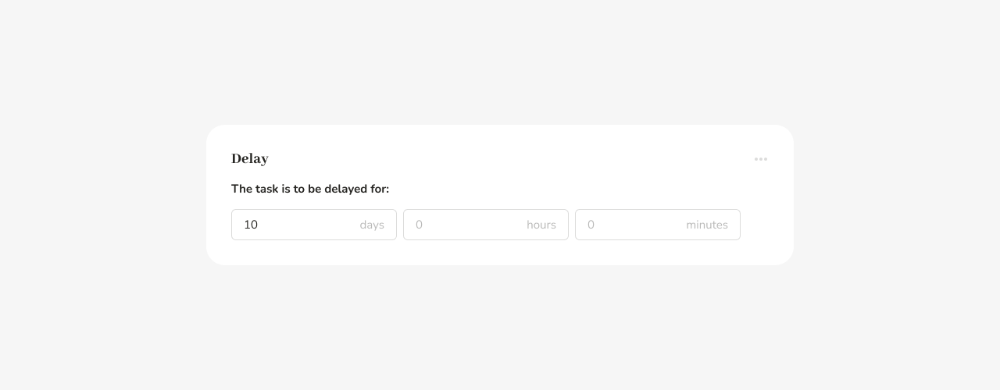
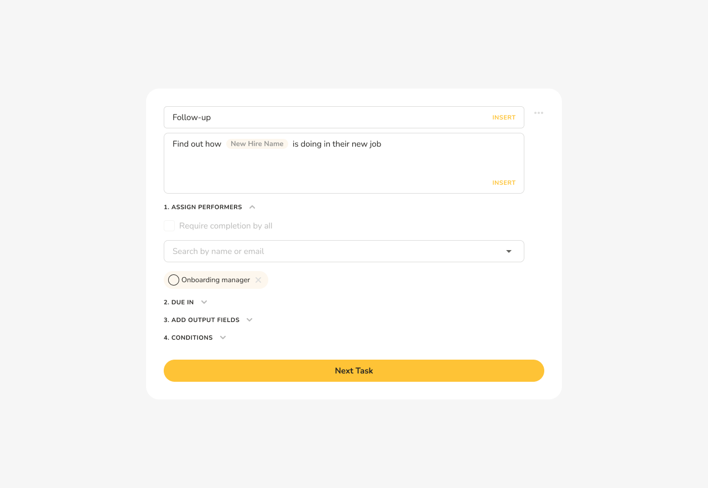
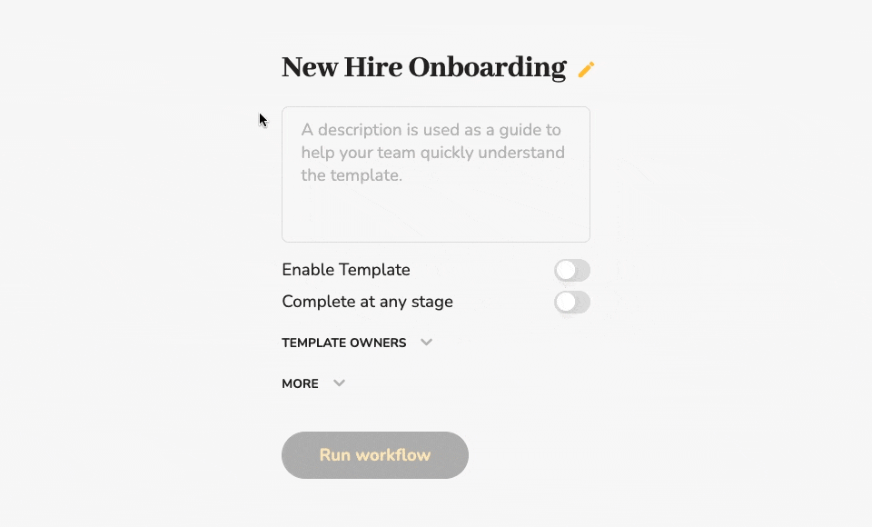

# How to Create Your First Workflow Template

## New Hire Onboarding

Let's create a simple new hire onboarding process.

To create a new template, go into Templates and click on New Template:

As soon as you do, Pneumatic will present you with a list of the workflow templates supplied with Pneumatic that you can clone and modify:

## Building a New Template from Scratch

The topmost option allows you to create a new template from scratch; if you click on that, the Pneumatic will create an empty new template for you:

## Running an Empty Template

You can actually enable and run it. It won’t do much, though; it will just assign a single empty task to you that you will be able to complete by simply clicking on Complete Task.

## Outlining your Basic SOP

Let’s instead outline a simple employee onboarding process.

Suppose we want to implement a simple onboarding process in which we invite our new hire to Pneumatic, then they have orientation, after that we have them sign an NDA if they need one, and then several days later, we do a follow-up.

The easiest way to go about creating this process in Pneumatic is to start adding steps to our template:

## Adding Steps to a Business Process

We add new steps by clicking on New Task. At this stage, we will enter the name of each step as we add them, starting with step one.

The goal is to end up with this sequence of steps:

## Kick-Off Forms

When a new workflow is launched, Pneumatic gets the information that might be required for the process from the user via the kick-off form.

Every template has a default kick-off form that asks the user for a name and description for the new workflow.

In Pneumatic, we can customize kick-off forms by adding fields to them.

## Adding Fields to the Kick-off Form

In our case, we’re going to need to know the new hire’s name, their email address, their role in the company (for simplicity’s sake, let’s assume we’re only interested to know whether or not the new hire is a software developer so we can have them sign an NDA if they are one) and we’re also going to want to appoint an onboarding manager who’ll be supervising the onboarding process:

Kick-off form fields can be required or optional. Let's make the name and email address, as well as the onboarding manager, required fields.

## Using Kick-Off Form Variables

After adding fields to the kick-off form, we can use them as variables throughout the workflow template:

For our first step, we want to specify who we’re inviting to Pneumatic and which email address to use to invite them to Pneumatic.

We also need to assign a performer to the task. You can select a performer from the dropdown list of your team, but note that the dropdown list also contains the onboarding manager variable from the kick-off form. Let's assign the first step to the onboarding manager, thus, effectively postponing the assignment of this step until a workflow is run from this template.

## Adding Output Fields to a Step

Finally, each step can also have output fields. In our case, the output field we want is the new hire’s account in Pneumatic. This can now be used as a variable in all the subsequent steps.

## Using Output Fields as Variables in Subsequent Steps

The Orientation step will be assigned to the onboarding manager and the new hire in Pneumatic; we will require completion by all: the new hire will complete the orientation, and the onboarding manager will sign off on it.

Note how we continue using our kick-off form fields and the output field from the previous step as variables in the name and performers of this step.

## Conditional Workflow Logic

The next step, signing an NDA, will only be needed if we’re hiring a new software developer - we want them to keep our IP confidential.

So we’re going to assign this to our new hire in Pneumatic, but only if their role is Software developer; otherwise, this step is to be skipped entirely. We can achieve this by adding a condition to our task: if the new hire role doesn’t equal software developer, then the step will be skipped.

## Putting the Process on Hold

At this stage, we can add a delay of 10 days to our process to give our new hire time to settle into their new job.

And after that, we’ll have our onboarding manager follow up on them:

## Running Workflows from a Workflow Template

So our template is ready, we can now enable it and start running workflows from it

