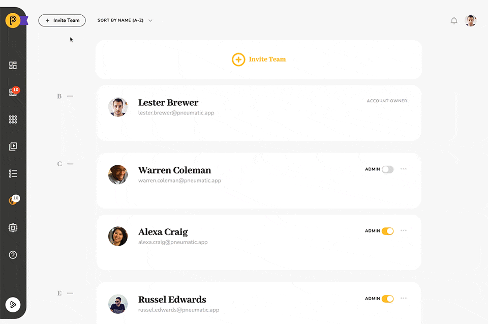
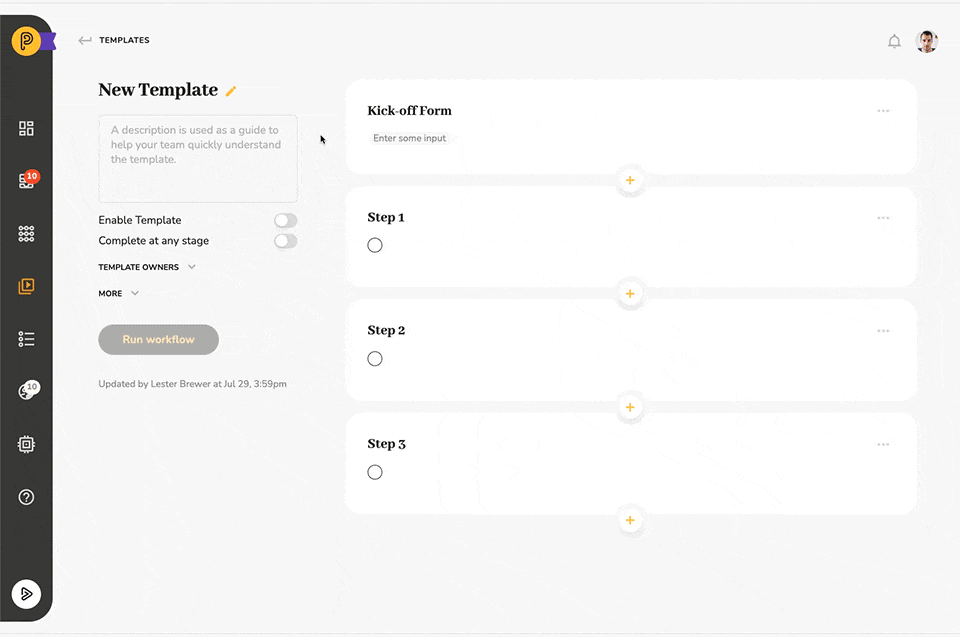

# Inviting Your Team to Pneumatic

## 

## Collaboration

Pneumatic is a collaboration tool in which tasks within a single workflow can be delegated or assigned to different members of your team.

So it’s only natural that Pneumatic goes out of its way to make it as easy as possible for you to invite your team members.

## Team

The first, most obvious, place where you can go to invite new members is in the Team section of the interface:

Just click on +Invite Team.

## Use Email

The default way to invite a new user is by entering their email address and clicking Add.

## Use Google or Slack

Alternatively, you can use your teammates’ Slack and Google accounts to invite them to Pneumatic:

## Inviting Performers to a Task

However, you don’t have to be in team management mode to invite new teammates.

Pneumatic gives you the option to invite new team members right when you’re adding performers to a task in a workflow template.

The first item on the add performer dropdown list is Invite Team Member which opens the exact same Invite New Team Member dialogue.

The newly invited teammate will be immediately added to the list of performers for the task. As soon as they accept the invitation and log into Pneumatic, the task will be added to their My Tasks list and they’ll be sent a notification that a new task’s been assigned to them.

The beauty of workflow management is that you don’t have to do everything yourself, instead, the name of the game is delegate, delegate, delegate.

Someone, that you want to assign a task to doesn’t have a Pneumatic account yet? No problem, just invite them.
