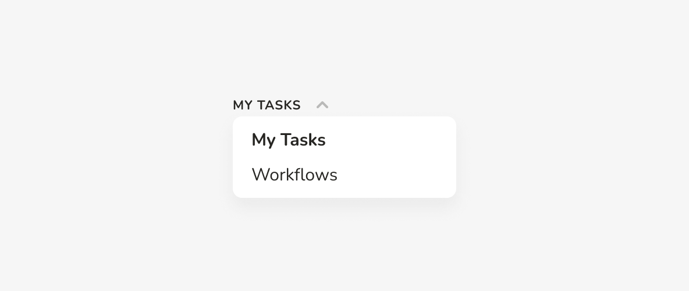
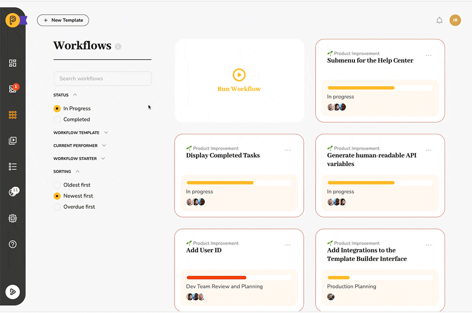
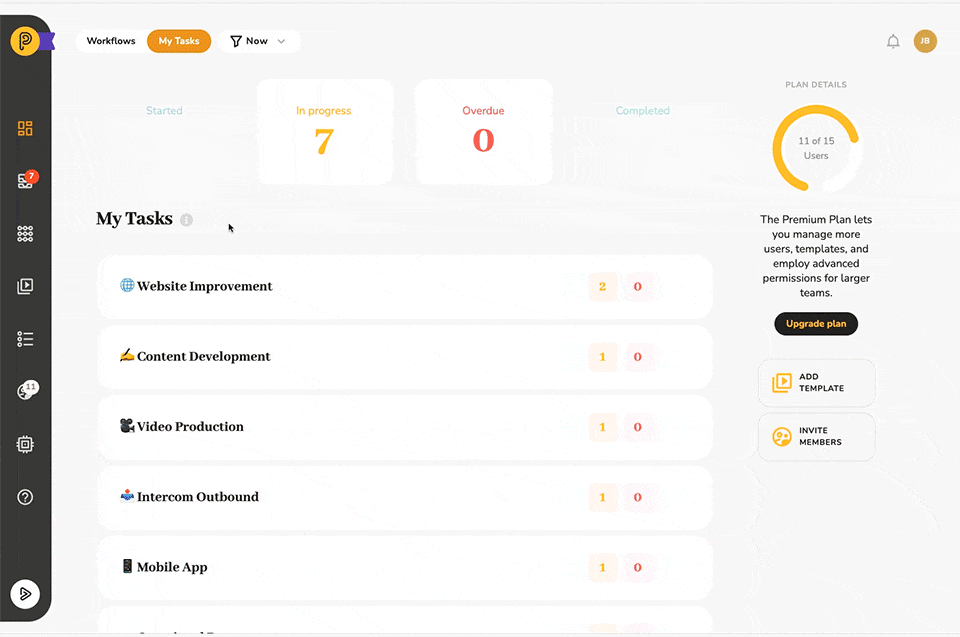

# Pneumatic Dashboard Views

## Workflow Dashboard vs. Task Dashboard

The Dashboard is all about numbers and quick access to workflows and tasks.

It has two principal views: **Workflows** and **Tasks.**

* **The Workflow Dashboard** gives you a birds-eye view of the business process you are in charge of.   
  ​
* **The Tasks Dashboard** allows you to easily keep track of the tasks that have been assigned to you.

You switch between the views in the upper left-hand corner:

## Workflows Dashboard

Clicking on a Workflow type opens a list of the steps. Here you get information about how many unique workflows are currently at each specific step and how many are overdue.

## Workflow Steps

Clicking on a Workflow type opens a list of the steps. Here you get information about how many unique workflows are currently at each specific step and how many are overdue.

## Drilling down into workflow details

All workflow metrics are clickable.

Click on a metric to see the workflows that went into it.

## Tasks Dashboard

The other Dashboard view is the Tasks view.

This view shows stats for the tasks assigned to you such as how many new tasks you were assigned to in a given period, how many were in progress, how many were overdue, and how many you completed in that period.

## Assigned Tasks

The tasks in this view are also organized by workflow type.

Click on a template name to open a list of the template steps that have tasks you're assigned to.

If you click on a step in the Tasks view, you will be taken to the My Tasks section in which the tasks will have been filtered by the workflow type and step you clicked on in the Dashboard.

Clicking on any of the numbers at the workflow level will take you to My Tasks filtered by the workflow type only:

