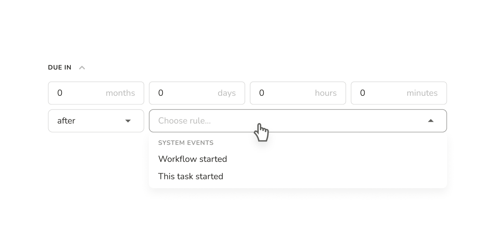
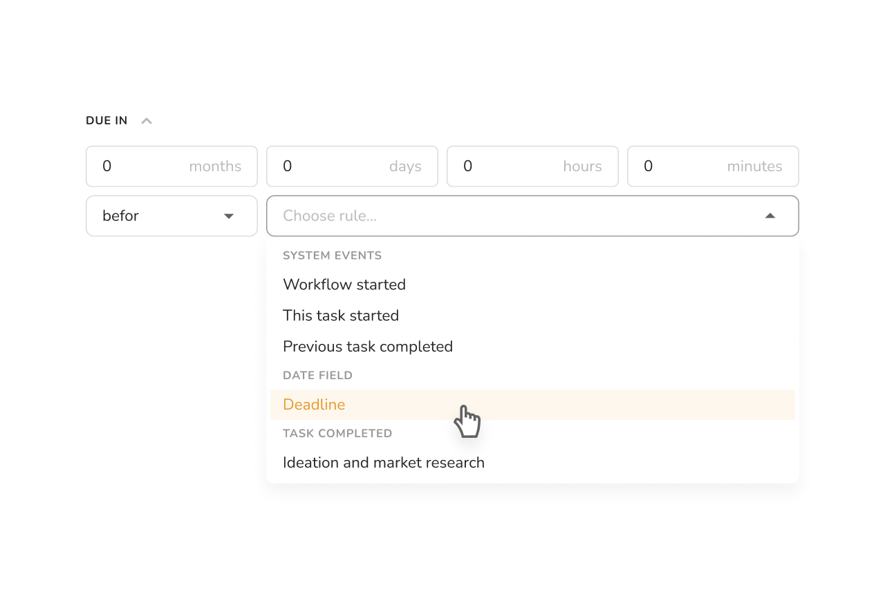
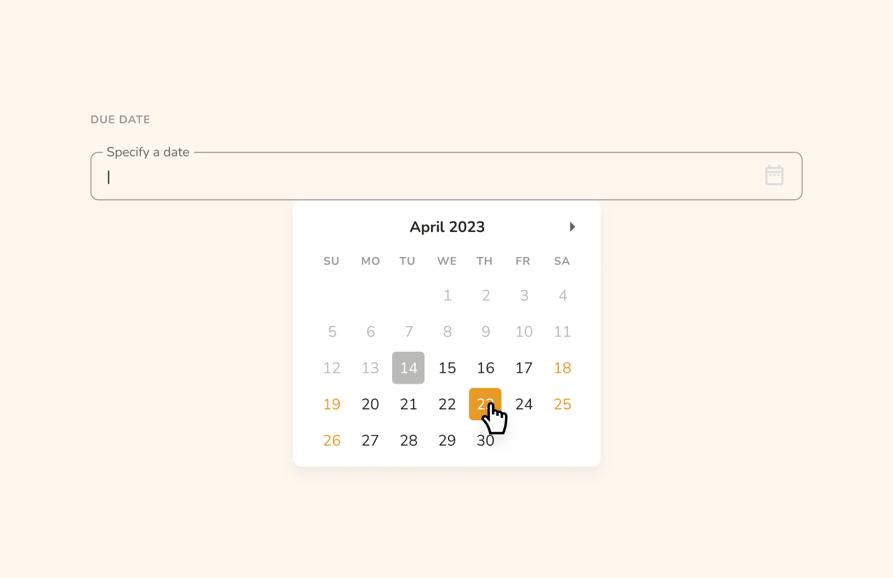

# Setting Deadlines for Tasks and Workflows

Deadlines play a crucial role in various business processes, ensuring the timely completion of tasks. Pneumatic offers two methods for managing deadlines. First, there's an enhanced the-task-will-be-due field available for each task in the workflow template. Second, users can set an overall deadline for a specific workflow.

**Let's dive into how to set deadlines in Pneumatic using a New Product Launch Process as an example. Suppose our new product launch process consists of the following steps:**

1. Ideation and market research
2. Product design and initial prototyping
3. Testing and refining prototypes
4. Finalizing design and preparing for production
5. Production and launch

To begin, you can set relative deadlines for each task in the process by specifying when the task will be due:

Here you set a relative deadlines by telling the system that once assigned, the task will be due M months, D days, H hours and M minutes after or before the event specified in the before/after field below. These include such events as "this task started", "previous task completed", "workflow started" and some others. Naturally, It's a smart field that won't let you require that the current task be completed, say, 5 days **before** the previous task is assigned.

Special mention should be made of the fact, that you can also use a date field from any of the previous tasks in the before/after field here. Thus, a date can be entered in a previous stage and if the date field from that stage is specified as the before value here, the dynamic deadline during workflow execution will be set as M months, D days, H hours and M minutes before that date.

For example, you can set deadlines of one month for ideation and design, two months for product design and initial prototyping, and so on.

Alternatively, you can set an absolute deadline for a specific new product launch workflow when initiating it:

This absolute deadline takes precedence over all relative deadlines set by the system based on due-in values. If a task is assigned after the workflow's deadline, it will automatically be marked as overdue.

In summary, Pneumatic allows you to set due-ins for individual tasks in a workflow type, which the system then uses to establish relative deadlines. Additionally, you can specify an overall deadline for an entire workflow, which takes precedence over individual task deadlines.
