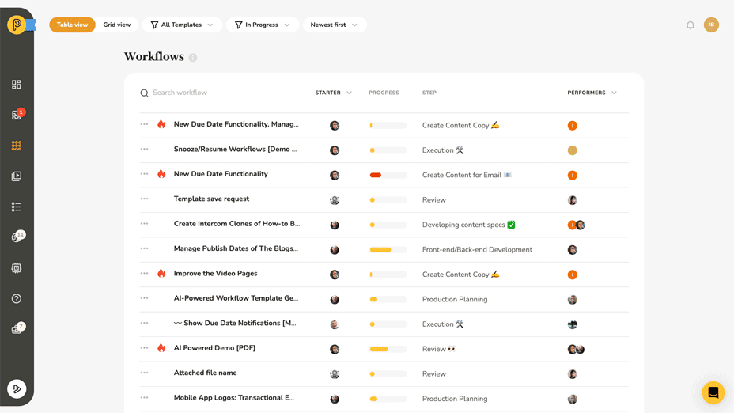
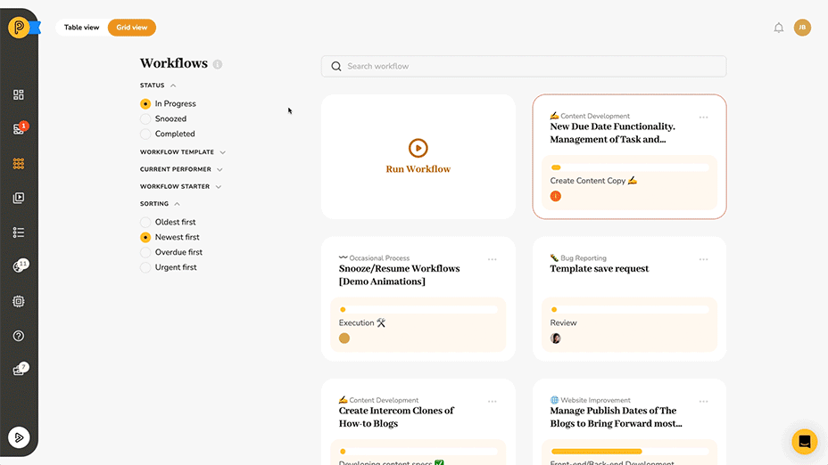

# Snoozing and Resuming Workflows in Pneumatic

As you go about managing workflows in Pneumatic, you may find yourself in a situation where you have to pause a workflow temporarily. The good news is that Pneumatic offers a snooze/resume feature that allows you to do just that.

## Snoozing a Workflow

When you snooze a workflow, it is temporarily removed from the list of in-progress workflows and added to the list of snoozed workflows. The workflow’s current task will disappear from the My Task lists of its performers. You can snooze a workflow for one day, one week or one month, depending on your needs.

To snooze a workflow, follow these steps:

1. Navigate to the workflow you want to snooze in the in-progress workflows list.
2. Click on the three dots icon to access the workflow management menu.
3. Select "Snooze" from the menu.
4. Choose the snooze duration (one day, one week, or one month).

## Resuming a Workflow

When the snooze period ends, the workflow will resume automatically. It will return to the list of in-progress workflows, and its current task will reappear in the My Tasks lists of its performers. However, if you want to resume a snoozed workflow manually, you can do so by following these steps:

1. Navigate to the list of snoozed workflows.
2. Find the workflow you want to resume.
3. Click on the three dots icon to access the workflow management menu.
4. Select "Resume" from the menu.
5. The workflow will be resumed, and its current task will appear in the My Task lists of its performers.

## Summary

In conclusion, the snooze/resume feature in Pneumatic is a powerful tool that allows you to pause and resume workflows as needed. Whether you need to take a break from a task or delay a workflow for a certain period, snooze/resume makes it easy to manage your workflows effectively.
