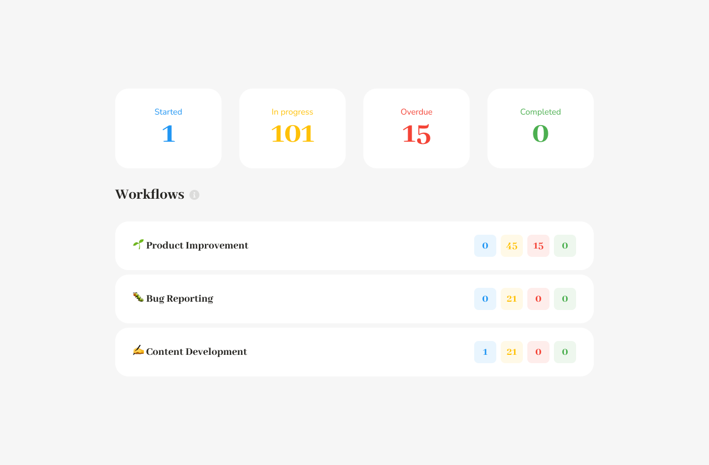
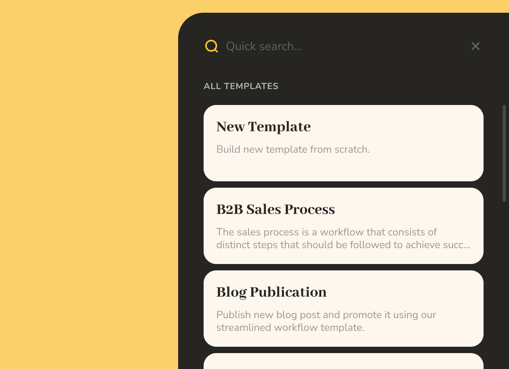
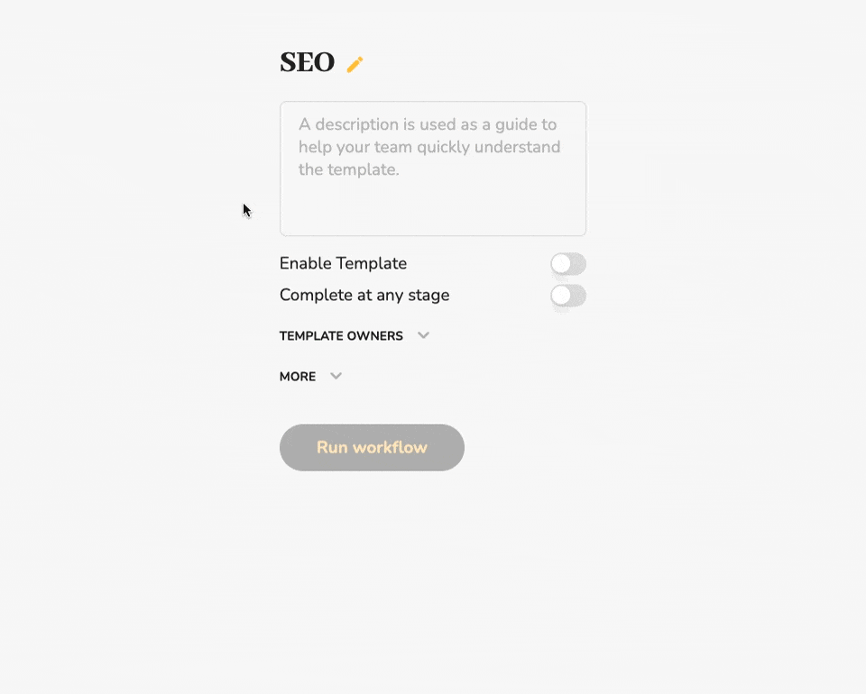
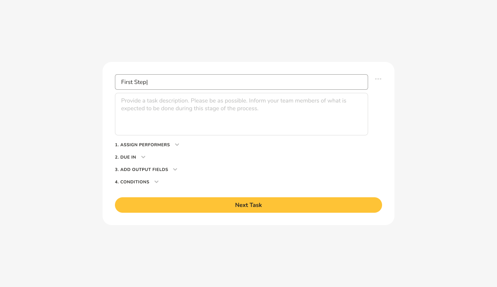
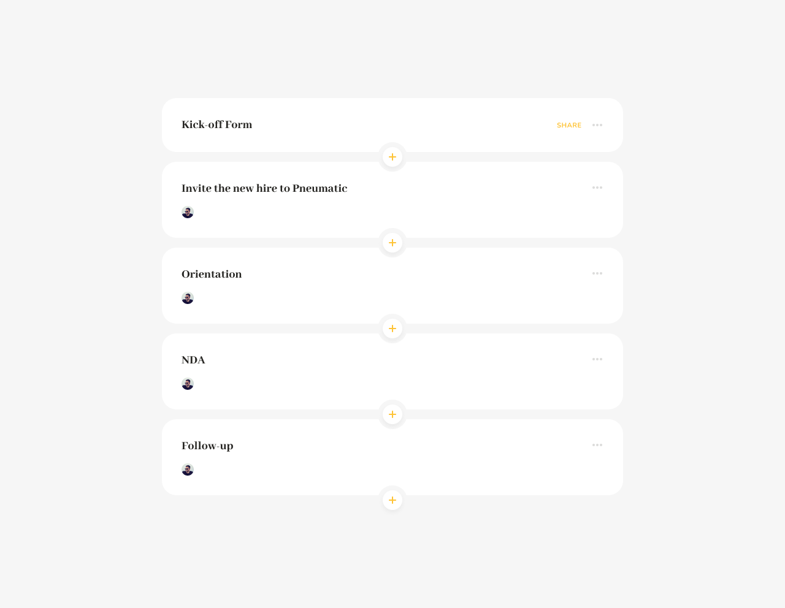

# Template Ownership

## **Ownership of Workflow Templates**

The Workflows Dashboard shows you information and metrics only for the workflow templates you're an owner of.

When getting started, it's only natural for all team members to have access to all workflow templates. And that's the default behavior Pneumatic supports out of the box in our Free Plan: whenever you create a new workflow template, all your team members automatically get added to the list of owners.

## 🔒 Granular Template Access Control

The approach where the entire team has access to all [workflow templates](how-to-create-your-first-workflow-template.md?utm_campaign=Template+Ownership&utm_content=%F0%9F%93%96+Template+Ownership&utm_medium=email_action&utm_source=customer.io) may not always work. When your business complexity increases, yet you keep automatically getting added to the list of owners of every new template, your resulting dashboard and list of workflows can soon become a bit of a mess.

Thus, Premium Plan users get the option of editing the list of owners for their workflow templates.

Furthermore, in this set-up, when you [create a new template](how-to-create-your-first-workflow-template.md?utm_campaign=Template+Ownership&utm_content=%F0%9F%93%96+Template+Ownership&utm_medium=email_action&utm_source=customer.io) you become its sole owner by default.

If you want other members of your team to be able to edit the template, [launch workflows](../getting-started/how-to-run-workflows.md?utm_campaign=Template+Ownership&utm_content=%F0%9F%93%96+Template+Ownership&utm_medium=email_action&utm_source=customer.io) from it and track their progress, you have to deliberately add them to the list of template owners.

## **Remove Clutter, Reduce Distractions**

The template ownership mechanism allows you to declutter your dashboard, reduce distractions, and only focus on tracking the business processes relevant to your role in the company.

At the same time, other stakeholders can create their own templates and run workflows without them messing up your or anybody else's dashboards.

You want other members of your team to be able to [run workflows](../getting-started/how-to-run-workflows.md?utm_campaign=Template+Ownership&utm_content=%F0%9F%93%96+Template+Ownership&utm_medium=email_action&utm_source=customer.io) from and edit a specific template?

Just add them to the list of owners for that template!

