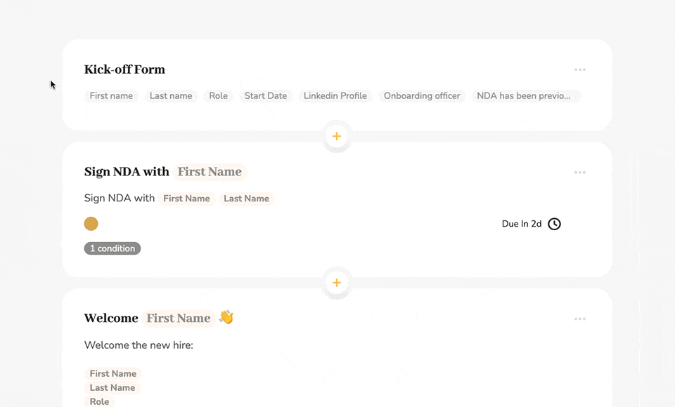
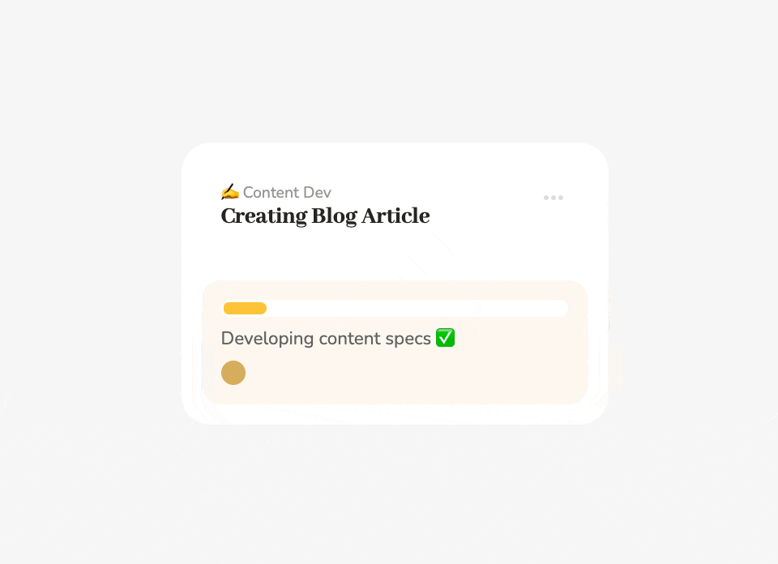

# Workflow Templates, Workflows and Tasks

## The Holy Trinity of Pneumatic

The three fundamental entities in Pneumatic are Workflow templates, Workflows, and Tasks:

## Standard operating procedures, a.k.a. workflow templates

You describe types or classes of business processes or standard operating procedures (SOPs) by creating workflow templates.

Each [workflow template](how-to-create-your-first-workflow-template.md) comprises a kick-off form and steps (or tasks).

## Workflows, or SOP instances

Once a new template is created, multiple workflows can be run from it.

As soon as a new workflow is run, Pneumatic starts assigning the tasks the workflow is comprised of to the performers specified for each task in the underlying workflow template.

The tasks making up a workflow get assigned sequentially, with every subsequent task only getting assigned after the previous task in the workflow has been completed.

You and your team members can find the tasks currently assigned to you in My Tasks:

When you select a task in [My Tasks](../features/my-tasks.md), you see its description, output fields as well as the log of the workflow the task belongs to up to that task.

As you complete tasks, they disappear from your list of tasks in My Tasks and as workflows progress from step to step or new workflows are launched, new tasks get assigned to you and your teammates.

Thus in Pneumatic, you start with workflow templates or SOPs, you then run workflows from your templates, and finally you and your team complete the tasks assigned to you by running workflows.

All the basic metrics are also presented in terms of workflows and workflow templates. Thus, in the dashboard, you see the number of launched workflows, workflows in progress, delayed and finished workflows. This information is then further broken down by workflow template or SOP:

​

