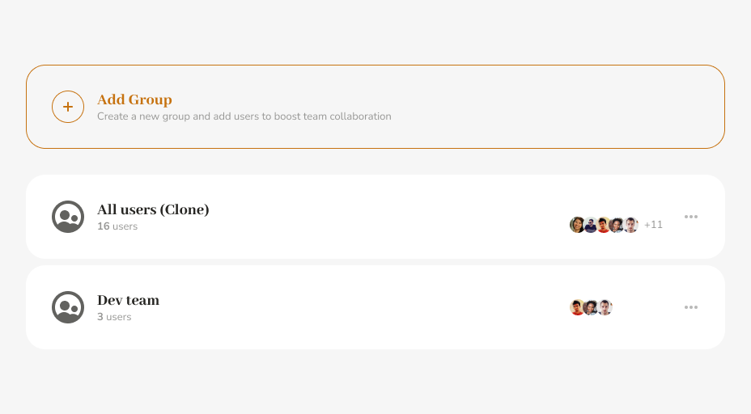
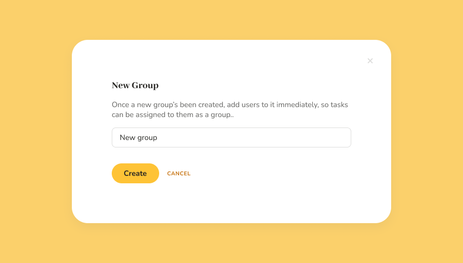
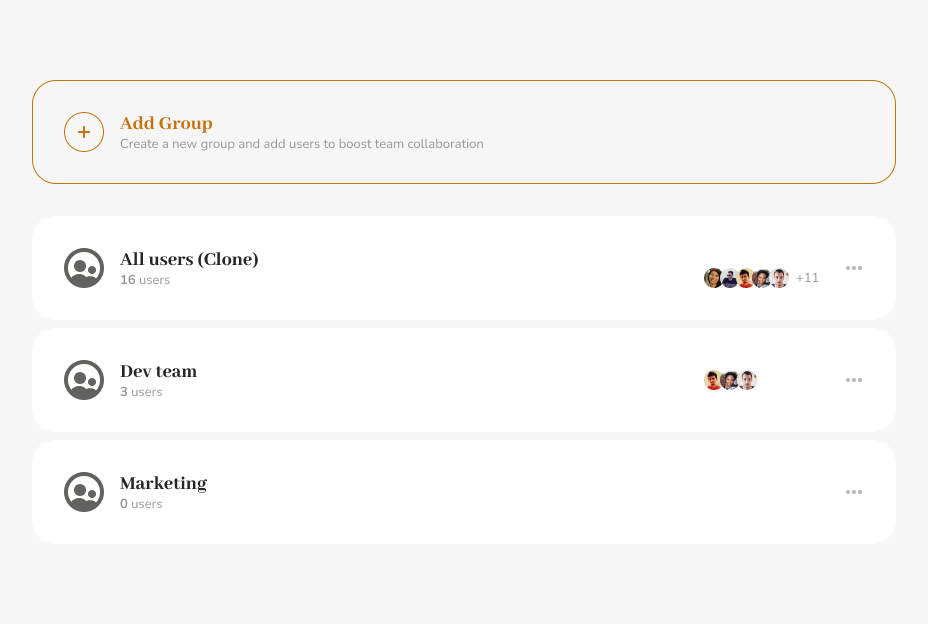
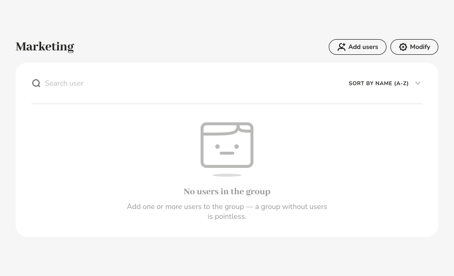
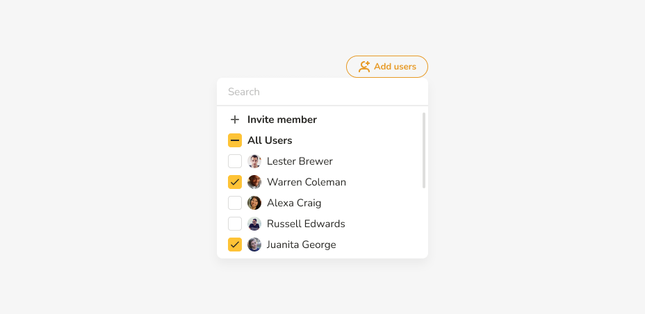
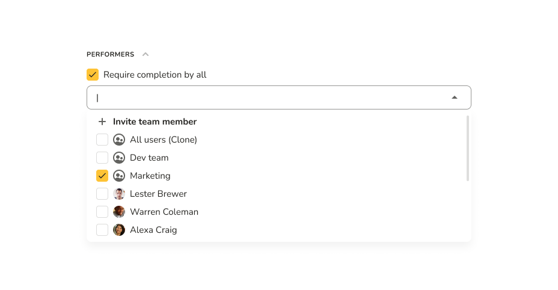
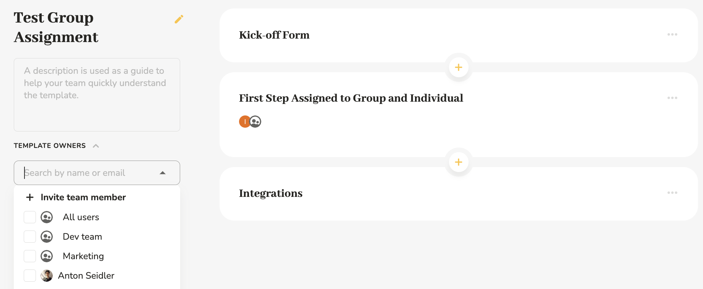

# User Groups

## How Groups Work

User groups allow you to manage users at a higher level by including them in one or several groups corresponding to specific departments or functions in your organizations.

Groups can then be treated as users: you can add them as owners to templates and assign them to tasks, either in templates or dynamically.

When a group is assigned to a task, this task appears in the task buckets of all the members of the group.

If a new user is added to a group, all of that group's current tasks will instantly appear in the new user's task bucket.

When a user is removed from a group, all of that group's tasks get removed from that user's task bucket.

## Where to Find

You find Groups in the Team section. If you're an admin user in Pneumatic, you can switch between managing individual users and managing groups:

Switch to Groups to add new groups and edit existing ones:

## Adding a New Group

Click Add Group to add a new group

Enter a name and click Create.

## Adding/Removing Users

To add/remove users or edit a group, click on a group's name, then use the buttons in the top right hand corner

Click Add Users to add/remove users. Just toggle the check box next to a user name to add (checkbox on) or remove(checkbox off) a user:

## Modifying a Group

Modifying a group means changing its name, cloning it (with all the users) or deleting it:

## Assigning Tasks to Groups

The principal use for user groups is to assign them as performers to tasks:

As has been mentioned at the beginning, when a group is added as a task performer, the task will get assigned to all the members of the group.

## Adding a Group as a Template Owner

Groups appear alongside users in the dropdown list for adding users to the list of template owners (at the top of the list)

Just tick the checkbox next to the group you want to add and it will become the template's owner, meaning that all the group members will now be able to launch new workflows from the template and admin members will also be able to edit the template.
