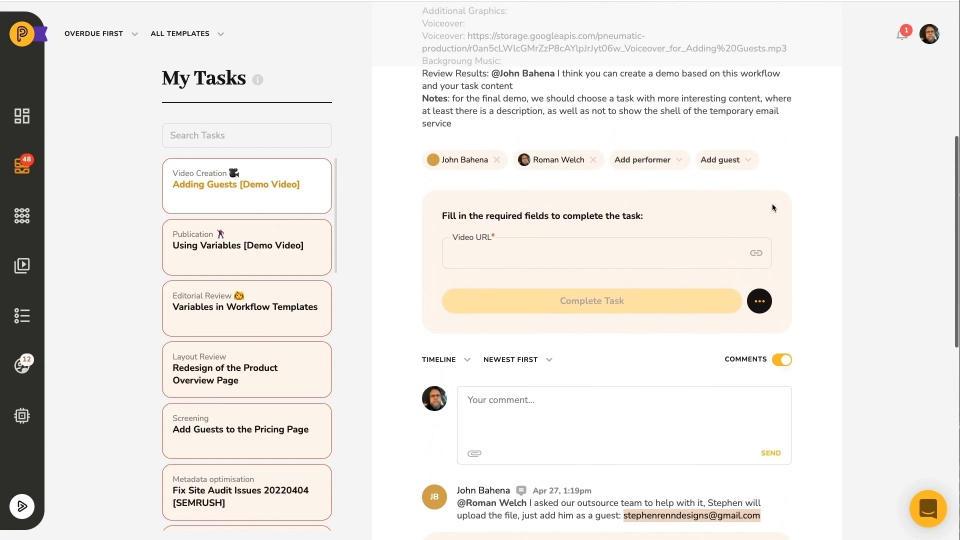

# Video: Adding Guests to Tasks

*Watching time: 1 minute*

Did you know that Pneumatic allows you to assign tasks to people who don't have a Pneumatic account completely free of charge? Find out how in this a-minute-and-a-half video guide.

  
*▶ [Watch video](https://fast.wistia.net/embed/iframe/xa7d8e7yrv?videoFoam=true)*

## **Watch more Pneumatic videos**

* [Engaging with External Users](video-engaging-with-external-users.md) *(2 minutes)*
* [Information Flow Via Data Fields](video-information-flow-via-data-fields.md) *(3 minutes)*
* [Working with Workflows](video-working-with-workflows.md) *(3 minutes)*
* [Working with Tasks](video-working-with-tasks.md) *(3 minutes)*
* [Task Management in Pneumatic](video-task-management-in-pneumatic.md) *(3 minutes)*
* [Dashboard Overview](video-dashboard-overview.md) *(2 minutes)*
* [Quick Product Overview](video-quick-product-overview.md) *(2 minutes)*
* [Getting Started with Workflow Templates](video-getting-started-with-workflow-templates.md) *(3 minutes)*
