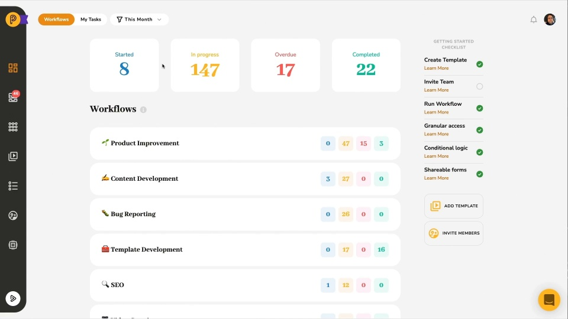

# Video: Dashboard Overview

*Watching time: 2 minutes*

Pneumatic comes equipped with powerful dashboards to let you stay on top of your workflows and tasks. Watch this quick video to get a feel for how to use Pneumatic Dashboards and be the master and commander of your tasks and workflows.

  
*▶ [Watch video](https://fast.wistia.net/embed/iframe/0ph9hqcku3?videoFoam=true)*

## Watch more Pneumatic videos

* [Engaging with External Users](video-engaging-with-external-users.md) *(2 minutes)*
* [Adding Guests to Tasks](video-adding-guests-to-tasks.md) *(1 minute)*
* [Information Flow Via Data Fields](video-information-flow-via-data-fields.md) *(3 minutes)*
* [Working with Workflows](video-working-with-workflows.md) (*3 minutes)*
* [Working with Tasks](video-working-with-tasks.md) *(3 minutes)*
* [Task Management in Pneumatic](video-task-management-in-pneumatic.md) *(3 minutes)*
* [Quick Product Overview](video-quick-product-overview.md) *(2 minutes)*
* [Getting Started with Workflow Templates](video-getting-started-with-workflow-templates.md) *(3 minutes)*
