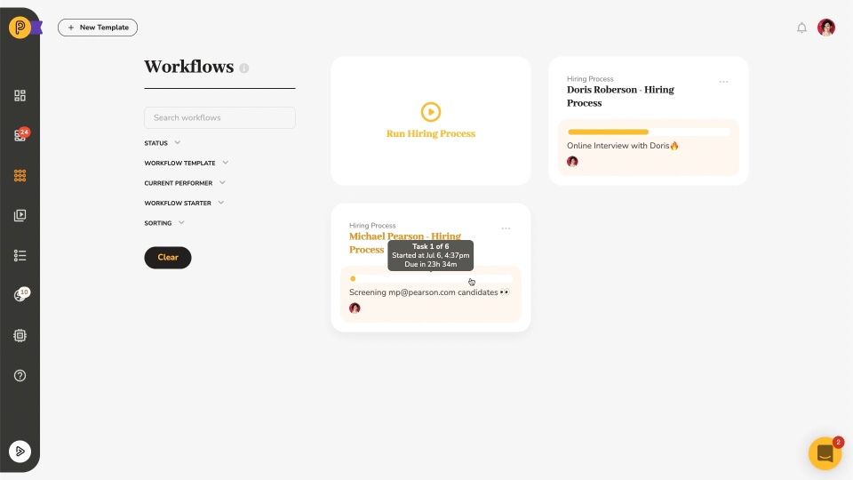

# Video: Engaging with External Users

*Watching time: 2 minutes*

Conceived of and designed as an open system from the ground up Pneumatic enables and encourages easy hassle-free collaboration not only with members of your team who have Pneumatic accounts but with external users as well.

In this video, we show you how to utilize sharable kick-off forms and invite guests to tasks to collaborate on your workflows with users from outside Pneumatic.

  
*▶ [Watch video](https://fast.wistia.net/embed/iframe/0imyhmk1kk?videoFoam=true)*

## Watch more Pneumatic videos

* [Getting Started with Workflow Templates](video-getting-started-with-workflow-templates.md) *(4 minutes)*
* [Adding Guests to Tasks](video-adding-guests-to-tasks.md) *(1 minute)*
* [Information Flow Via Data Fields](video-information-flow-via-data-fields.md) *(3 minutes)*
* [Working with Workflows](video-working-with-workflows.md) (*3 minutes)*
* [Working with Tasks](video-working-with-tasks.md) *(3 minutes)*
* [Task Management in Pneumatic](video-task-management-in-pneumatic.md) *(3 minutes)*
* [Dashboard Overview](video-dashboard-overview.md) *(2 minutes)*
* [Quick Product Overview](video-quick-product-overview.md) *(2 minutes)*
