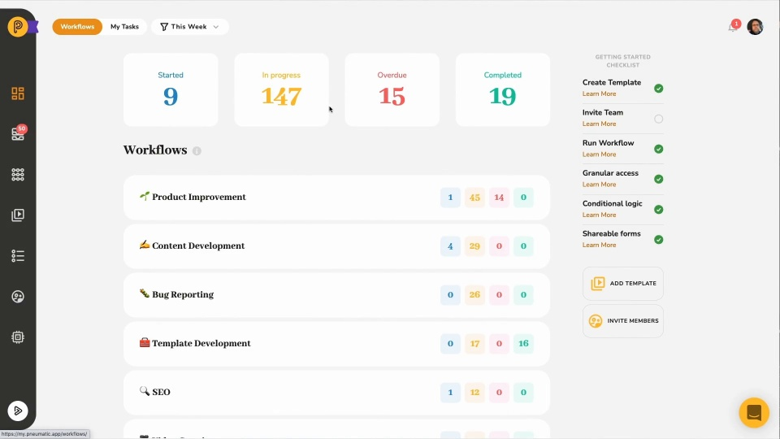

# Video: Getting Started with Workflow Templates

*Watching time: 3 and a half minutes*

In Pneumatic, you define your organization's SOPs by creating templates to run multiple workflows from.

In this video, we show you how to create a fairly straightforward new hire onboarding template, which, despite its simplicity, makes use of a number of advanced features such as template variables and conditional workflow logic.

  
*▶ [Watch video](https://fast.wistia.net/embed/iframe/7iktj0svzg?videoFoam=true)*

## Watch more Pneumatic videos

* [Engaging with External Users](video-engaging-with-external-users.md) *(2 minutes)*
* [Adding Guests to Tasks](video-adding-guests-to-tasks.md) *(1 minute)*
* [Information Flow Via Data Fields](video-information-flow-via-data-fields.md) *(3 minutes)*
* [Working with Workflows](video-working-with-workflows.md) (*3 minutes)*
* [Working with Tasks](video-working-with-tasks.md) *(3 minutes)*
* [Task Management in Pneumatic](video-task-management-in-pneumatic.md) *(3 minutes)*
* [Dashboard Overview](video-dashboard-overview.md) *(2 minutes)*
* [Quick Product Overview](video-quick-product-overview.md) *(2 minutes)*
