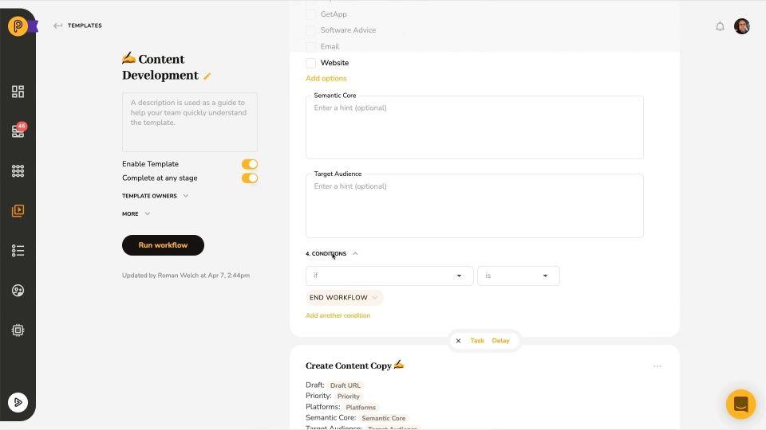

# Video: Quick Product Overview

*Watching time: 2 minutes*

As your company's business processes mature and your team grows beyond 10-15 people, focus inevitably shifts from managing tasks to managing sequences of related tasks, or workflows.

This video is a quick overview of how workflow management works in Pneumatic:

  
*▶ [Watch video](https://fast.wistia.net/embed/iframe/h5y4e0wxom?videoFoam=true)*

## Watch more Pneumatic videos

* [Engaging with External Users](video-engaging-with-external-users.md) *(2 minutes)*
* [Adding Guests to Tasks](video-adding-guests-to-tasks.md) *(1 minute)*
* [Information Flow Via Data Fields](video-information-flow-via-data-fields.md) *(3 minutes)*
* [Working with Workflows](video-working-with-workflows.md) (*3 minutes)*
* [Working with Tasks](video-working-with-tasks.md) *(3 minutes)*
* [Task Management in Pneumatic](video-task-management-in-pneumatic.md) *(3 minutes)*
* [Dashboard Overview](video-dashboard-overview.md) *(2 minutes)*
* [Getting Started with Workflow Templates](video-getting-started-with-workflow-templates.md) *(3 minutes)*
