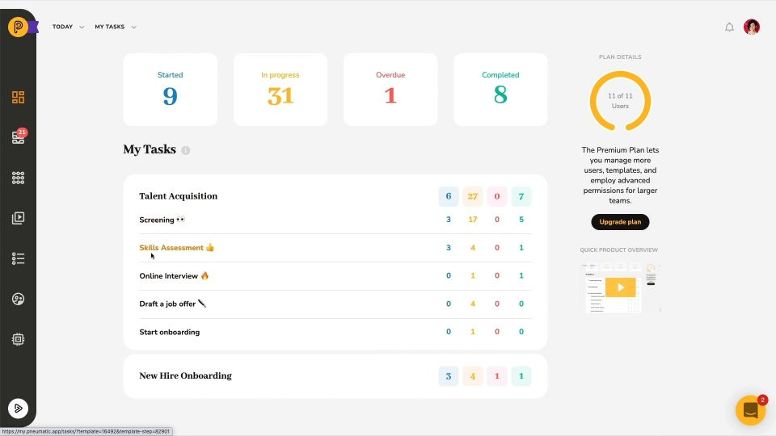

# Video: Task Management in Pneumatic

*Watching time: 3 minutes*

This video demonstrates where to see the tasks assigned to you. How to choose which tasks to work on. How to open and complete individual tasks.

  
*▶ [Watch video](https://fast.wistia.net/embed/iframe/bc8qqo7q4i?videoFoam=true)*

## Watch more Pneumatic videos

* [Engaging with External Users](video-engaging-with-external-users.md) *(2 minutes)*
* [Adding Guests to Tasks](video-adding-guests-to-tasks.md) *(1 minute)*
* [Information Flow Via Data Fields](video-information-flow-via-data-fields.md) *(3 minutes)*
* [Working with Workflows](video-working-with-workflows.md) (*3 minutes)*
* [Working with Tasks](video-working-with-tasks.md) *(3 minutes)*
* [Dashboard Overview](video-dashboard-overview.md) *(2 minutes)*
* [Quick Product Overview](video-quick-product-overview.md) *(2 minutes)*
* [Getting Started with Workflow Templates](video-getting-started-with-workflow-templates.md) *(3 minutes)*
