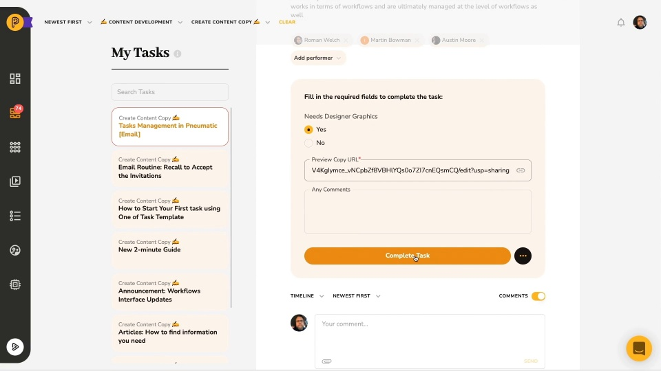

# Video: Working with Tasks

*Watching time: 3 minutes*

Pneumatic is all about workflows but each workflow is a sequence of tasks that get assigned automatically to different members of your team as the workflow progresses. Watch this short video to learn about where you can find all your tasks, how to filter them, how to complete a task and what else you can do with a task other than completing it.

  
*▶ [Watch video](https://fast.wistia.net/embed/iframe/9alph7mswn?videoFoam=true)*

## Watch more Pneumatic videos

* [Engaging with External Users](video-engaging-with-external-users.md) *(2 minutes)*
* [Adding Guests to Tasks](video-adding-guests-to-tasks.md) *(1 minute)*
* [Information Flow Via Data Fields](video-information-flow-via-data-fields.md) *(3 minutes)*
* [Working with Workflows](video-working-with-workflows.md) (*3 minutes)*
* [Task Management in Pneumatic](video-task-management-in-pneumatic.md) *(3 minutes)*
* [Dashboard Overview](video-dashboard-overview.md) *(2 minutes)*
* [Quick Product Overview](video-quick-product-overview.md) *(2 minutes)*
* [Getting Started with Workflow Templates](video-getting-started-with-workflow-templates.md) *(3 minutes)*
