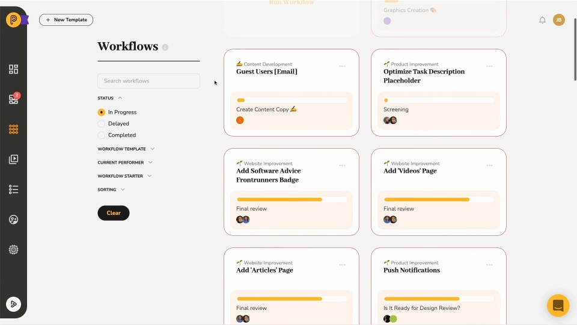

# Video: Working with Workflows

*Watching time: 3 minutes*

Pneumatic is all about managing live workflows, watch the short video below to learn about where you can find all your in-progress and completed workflows, how you can filter them, what kind of information you can find on the workflow tiles and in the workflow logs and more...

  
*▶ [Watch video](https://fast.wistia.net/embed/iframe/1908df5cou?videoFoam=true)*

## Watch more Pneumatic videos

* [Engaging with External Users](video-engaging-with-external-users.md) *(2 minutes)*
* [Adding Guests to Tasks](video-adding-guests-to-tasks.md) *(1 minute)*
* [Information Flow Via Data Fields](video-information-flow-via-data-fields.md) *(3 minutes)*
* [Working with Tasks](video-working-with-tasks.md) *(3 minutes)*
* [Task Management in Pneumatic](video-task-management-in-pneumatic.md) *(3 minutes)*
* [Dashboard Overview](video-dashboard-overview.md) *(2 minutes)*
* [Quick Product Overview](video-quick-product-overview.md) *(2 minutes)*
* [Getting Started with Workflow Templates](video-getting-started-with-workflow-templates.md) *(3 minutes)*
